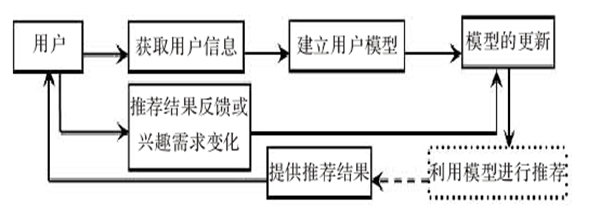

# 推荐系统

互联网上的内容，由最初的分类目录到搜索引擎，再到推荐系统，根据用户的历史行为而不是明确的需求，给出可能满足兴趣或者需求的信息。推荐系统和搜索引擎的区别在于，搜索引擎需要用户主动给出明确的查询，而推荐系统主动向用户推荐物品。

搜索引擎下，用户兴趣是在搜索词里面精确规定的，而内容是以网页或者多媒体的形式被索引，主要的难点在于把查询和文档内容的语义上的区别。而推荐系统里面用户兴趣是隐含在交互历史、人口统计学或者上下文中，被推荐的样本的形式也会非常丰富，主要的挑战是用户和样本之间的语义上的割裂，者尤其严重，因为用户和样本完全是不一样的实体，有不一样的特征序列。

在大多数情况下用户没有明确的需求，推荐系统可以帮助用户发现需要的信息，以及给用户提供一些意想不到的东西。他的任务是，联系用户和物品，解决信息过载的问题，帮助用户发现对自己有价值的信息，并且让信息展现在对他感兴趣的用户面前。

推荐系统具有三个重要模块：

- 用户建模模块
- 推荐对象建模模块
- 推荐算法模块

用户建模：

对象建模：

考虑对象提取什么特征，如何提取，提取特征的目的，特征描述和用户文件描述的关联，以及对结果的影响等。将对象根据抽取的特征进行向量化，

推荐系统的基本原理是：

- 获得用户模型中的兴趣需求信息
- 和推荐对象模型中特征进行匹配
- 使用推荐算法进行筛选计算
- 找到用户可能感兴趣的对象推荐给用户

推荐算法本质是，通过一定的方式将用户和物品联系起来，而不同的推荐系统利用了不同的方式。这种联系一般参考用户的历史兴趣、好友或者用户注册信息等。

推荐系统的核心问题：

- 预测：有监督的学习和回归问题，预测喜好
- 推荐：有监督学习，对预测结果的排序
- 解释：对推荐列表的解释

输出一般分为两种：

- 推荐列表：推荐给用户的物品列表，排序问题或者Top-K问题
- 推荐评分：推荐给用户的物品的评分，回归问题

输入一般为：

- 项目
- 用户
- 行为日志（评分矩阵）
- 其他附加信息

简言之输入包括：社交网络数据、用户行为数据、上下文、用户标签等

算法输入的评分矩阵，一般是一个表格，每一行代表一个用户，每一列代表一个物品，表格中的每个元素代表用户对物品的评分。

按照用户的反馈的明确性，开源份额为i显性反馈和隐性反馈。按照反馈的方向分为正反馈和负反馈。

显性反馈是用户明确地反馈，比如明确大而烦恼和标注爱好或者评论；有点是简单直接，信息具体全面客观可靠；缺点是数据稀疏，用户不愿意花时间去标注。而且不一定代表用户的真实需要，比如用户可能喜欢在平台给某个东西打差评为乐，或者为了鼓励作者、政治正确等，而不是真的“感兴趣”而打高分。

隐性反馈并不是目的在于表达兴趣，只是正常使用产品而产生的。这些原始日志会在服务正常允许过程中产生，而将其汇总成会话日志（session log）分析。这些日志记录了用户的各种行为，比如点击、浏览、购买、收藏、分享等。隐性反馈的优点是数据量大、更加稠密、不会给用户造成负担，更容易收集；缺点是数据不够准确，噪声大，用户的行为不一定代表兴趣。但是很大程度上，隐式反馈更能代表真实想法，比如用户喜欢观看乐子并且打差评的行为；并且常常和模型的目标函数关联更为密切。但是他有一个缺点就是，短视，譬如低俗、标题党等信息回引诱用户点击但是实际上不应该被推荐，如果平台总是推荐这种内容回反而降低平台的口碑和价值。因此需要结合显性反馈和隐性反馈来进行推荐。此外，对于数据量本身很少的小众信息，显示反馈可靠性很小，就需要依赖隐性反馈。

目前推荐系统的几个挑战：

- 冷启动
- 数据稀疏
- 恶意攻击（譬如刷分）
- 可解释性

数据集也回包含不同的行为，比如 Movie lense 就是一个显性反馈数据集，包含用户对电影的评分。
