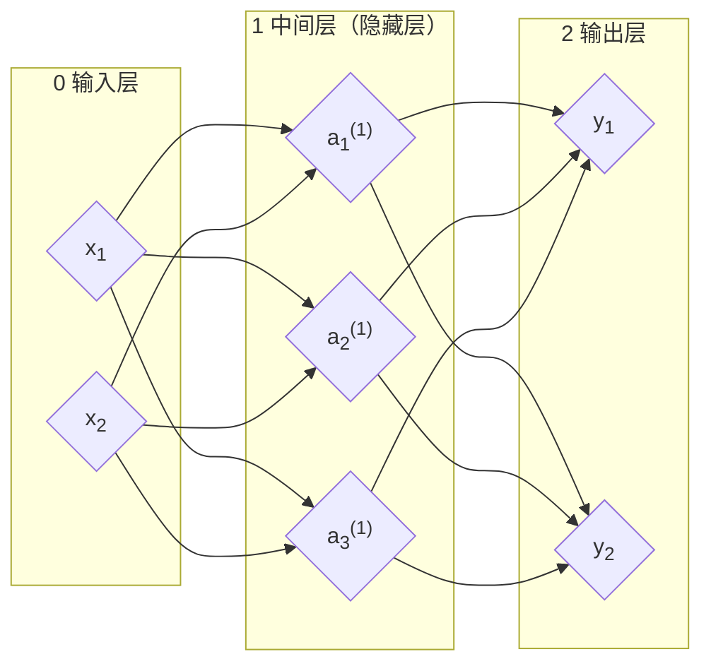
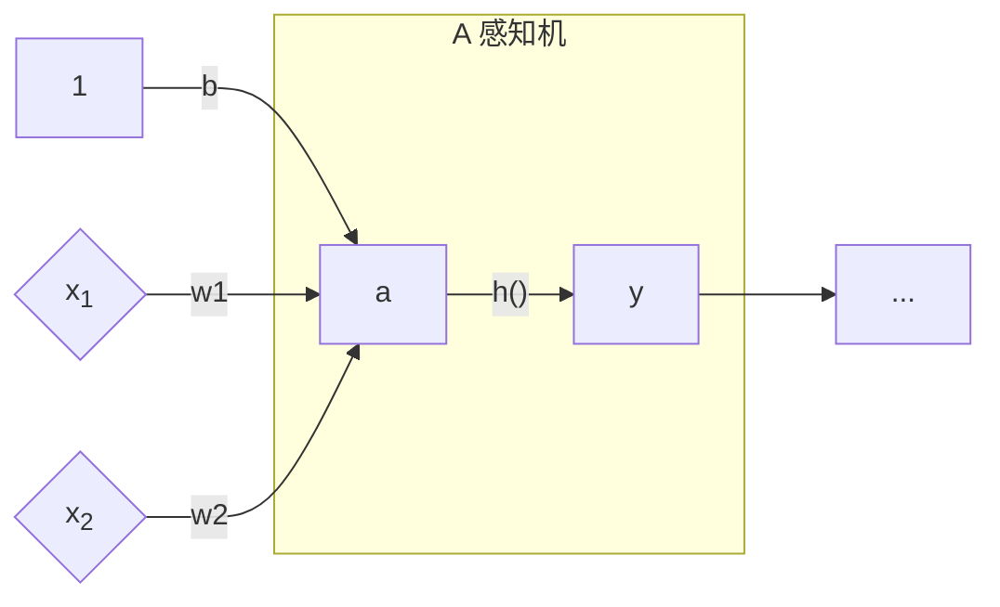

# 深度学习 - 从感知机到神经网络

## 感知机

假设存在若干个输入信号，对其按照某个权重进行加权求和，然后通过一个阈值函数，小于阈值则输出0，否则输出1。这就是感知机的基本结构。对于两个输入$x_1$和$x_2$，感知机的输出为：

$$
y = \begin{cases}
0, & w_1x_1 + w_2x_2 \leq \theta \\
1, & w_1x_1 + w_2x_2 > \theta
\end{cases}
$$

其中$w_1$和$w_2$是权重，$\theta$是阈值。并且可以将阈值移项，得到：

$$
y = \begin{cases}
0, & w_1x_1 + w_2x_2 + b \leq 0 \\
1, & w_1x_1 + w_2x_2 + b > 0
\end{cases}
$$

此处的$(-\theta)$被取代为另一个东西，**偏置**$b$。

感知机的一个应用就是，可以充当一个逻辑门使用。比如，当$(w_1, w_2, \theta) = (0.5, 0.5, 0.7)$时，感知机的输出就是与门。类似地可以表示或门、与非门等。

对于其他的一些门电路，比如异或门，感知机就无法表示了。这是因为感知机是线性的，而异或门是非线性的。可以在坐标内很容易画出分隔开或门和与门的线，但是异或门不可以用一条线分隔开取值为0或者1的点。因此，单个的感知机没有办法表示异或门；但是，异或的关系可以写为：

$$
\begin{align*}
x_1 \oplus x_2 & = (x_1 \land \lnot x_2) \lor (\lnot x_1 \land x_2) \\
& = (x_1 \lor x_2) \land (\lnot x_1 \lor \lnot x_2)
\end{align*}
$$

这样，就可以用多个感知机来表示异或门。只需要用感知机互相连接，并且设置好合适的参数去分别用作与门、或门、非门，就可以表示出异或门。

这里面就实现了一个效果：通过线性关系的叠加，可以实现非线性的分类效果，极大地扩展了感知机的应用场景。比如，由于计算机进行计算的本质就是一系列的逻辑门，通过堆叠感知机并且赋予适当的参数，就可以实现一个计算机的模型。

总之，感知机是一个给定输入可以获得到一个布尔输出的算法。其有两个重要的参数：权重和偏置。通过调整这两个参数，可以实现不同的逻辑门。但是，感知机是线性的，但是其可以通过叠加来实现非线性的效果。

## 神经网络

刚才创建的“异或门”就可以视为一个神经网络。一个基本的神经网络可以分为三层：

### 激活函数

首先回到感知机，感知机其实可以写作这样的一个函数：

$$
y = h(b + w_1x_1 + w_2x_2)
$$

其中

$$
h(x) = \begin{cases}
0, & x \leq 0 \\
1, & x > 0
\end{cases}
$$

这个函数$h(x)$就可以被称为**激活函数**。由于$b$可以认为是又一个输入的权重，而这个输入一定为1，因此在画图的过程中就省略了。

所以一个感知机可以被表示为

这里面的$y$表示的就是感知机的输出。这个东西可被称为**神经元**或者**节点**。

这里面举例的$h(x)$是一个阶跃函数，但是这个函数并不连续。可以使用其他的激活函数，比如**sigmoid函数**：

$$
h(x) = \frac{1}{1 + \exp(-x)}
$$

可以把激活函数的不同视为朴素的感知机和神经网络里面神经元的不同。感知机的神经元是一个阶跃函数，而神经网络的神经元是一个sigmoid函数。

这个函数的特点包括：

- 连续，因此可以表示的数值不仅限于0和1
- 单调递增，输入大小对应输出大小，但是把无穷的输入映射到0和1之间，而且大体的走向和阶跃函数相似
- 非线性
- 可微，这个特点在后面的训练中会用到

激活函数必须是一个非线性函数，因为线性函数随着权重的叠加仍然是一个线性的函数，毫无意义。

此外，还有其他的激活函数，比如**ReLU函数**：

$$
h(x) = \max(0, x)
$$

这个函数非常简单，而且有非线性的特点。

### 向量的计算

由于在计算机内，存在这样的现象，即向量的计算会被优化并且可以使用专门的硬件进行加速；而循环的计算则会比较慢。

根据线性代数，向量和矩阵的乘法，可以用于表示神经网络的一层的计算。对于一次计算，可以表示为：

$$
\mathbf{A} = \mathbf{X}\mathbf{W} + \mathbf{B}
$$

其中$\mathbf{X}$是输入，$\mathbf{W}$是权重，$\mathbf{B}$是偏置。具体而言：

$$
\begin{align*}
\mathbf{A} & = \begin{bmatrix}
a_{1} \\
a_{2} \\
a_{3}
\end{bmatrix} \\
\mathbf{X} & = \begin{bmatrix}
x_{1} & x_{2}
\end{bmatrix} \\
\mathbf{W} & = \begin{bmatrix}
w_{11} & w_{12} & w_{13} \\
w_{21} & w_{22} & w_{23}
\end{bmatrix} \\
\mathbf{B} & = \begin{bmatrix}
b_{1} \\
b_{2} \\
b_{3}
\end{bmatrix}
\end{align*}
$$

这样，就可以得到：

$$
\begin{align*}
a_{1} & = w_{11}x_{1} + w_{12}x_{2} + b_{1} \\
a_{2} & = w_{21}x_{1} + w_{22}x_{2} + b_{2} \\
a_{3} & = w_{31}x_{1} + w_{32}x_{2} + b_{3}
\end{align*}
$$

这是一层的计算；随后将结果输入到激活函数中，就可以得到下一层的输入。实际上在代码的实现中，可以直接将向量带入到激活函数里面，不需要挨个遍历而创建一个新的向量对象。

这里面会发现，实际上在实现这个过程的时候，实际上每一层都是完全相同的式子，即输入向量乘以权重矩阵，再加上偏置向量。不会存在维度的担忧，因为参数的数量刚好可以让这个计算有意义。

### 输出层的设计

输出层一般分为两种情况，一种是回归问题，一种是分类问题。

对于回归问题，输出层的激活函数一般是恒等函数，不赘述。

对于分类问题，输出层的激活函数一般是**softmax函数**：

$$
y_k = \frac{\exp(a_k)}{\sum_{i=1}^{n}\exp(a_i)}
$$

这个函数可以将输出的向量转化为概率分布，即所有的输出的和为1。然后这就可以表示每一个可能的类别的概率。

在实际的计算中，由于指数函数的特性，可能会出现数值上溢的问题。这个时候可以使用下面的等价公式：

$$
y_k = \frac{\exp(a_k + c)}{\sum_{i=1}^{n}\exp(a_i + c)}
$$

相对于整个分数同时分子分母乘以了$\exp(c)$，这样就不会影响到最终的结果，但是可以避免数值上溢的问题。一般情况下取$c = -\max(a_i)$。

很显然softmax函数是一个单调增的函数，因此大小关系不会改变，输出层最大值的位置不会改变。整个函数一般会被省略，因为只需要知道最大值的位置就可以了。

对于分类问题，输出层的神经元数量就是类别的数量。而对于回归问题，输出层的神经元数量通常就是1。
