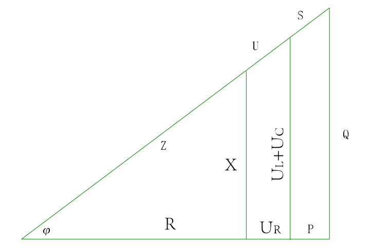
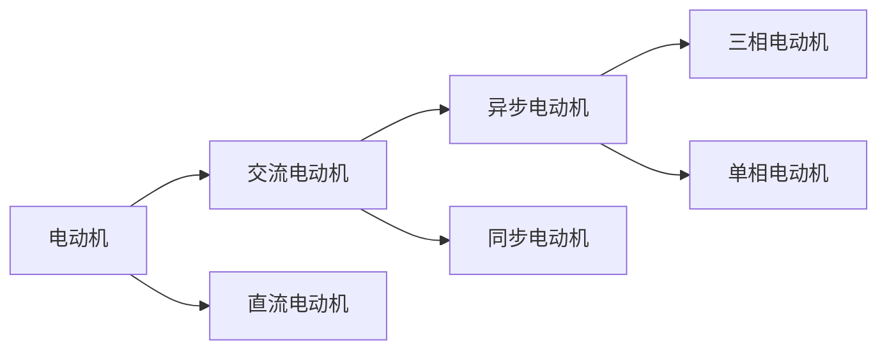
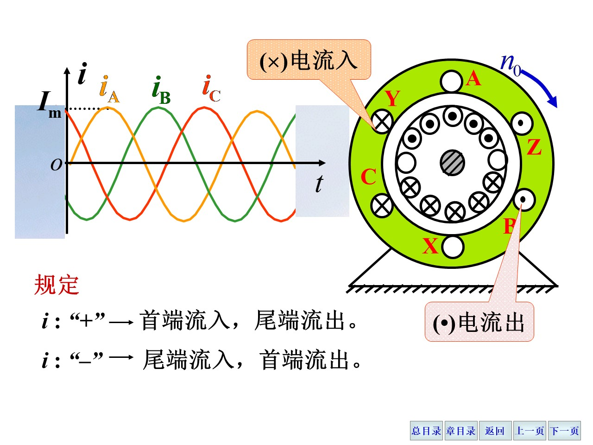
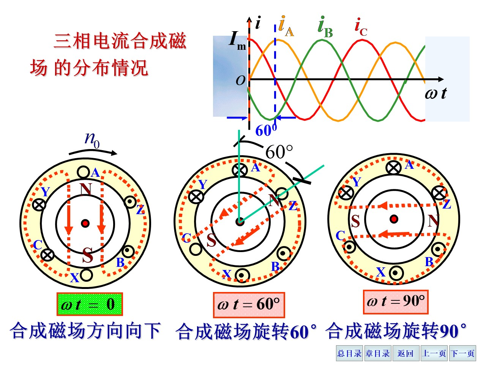
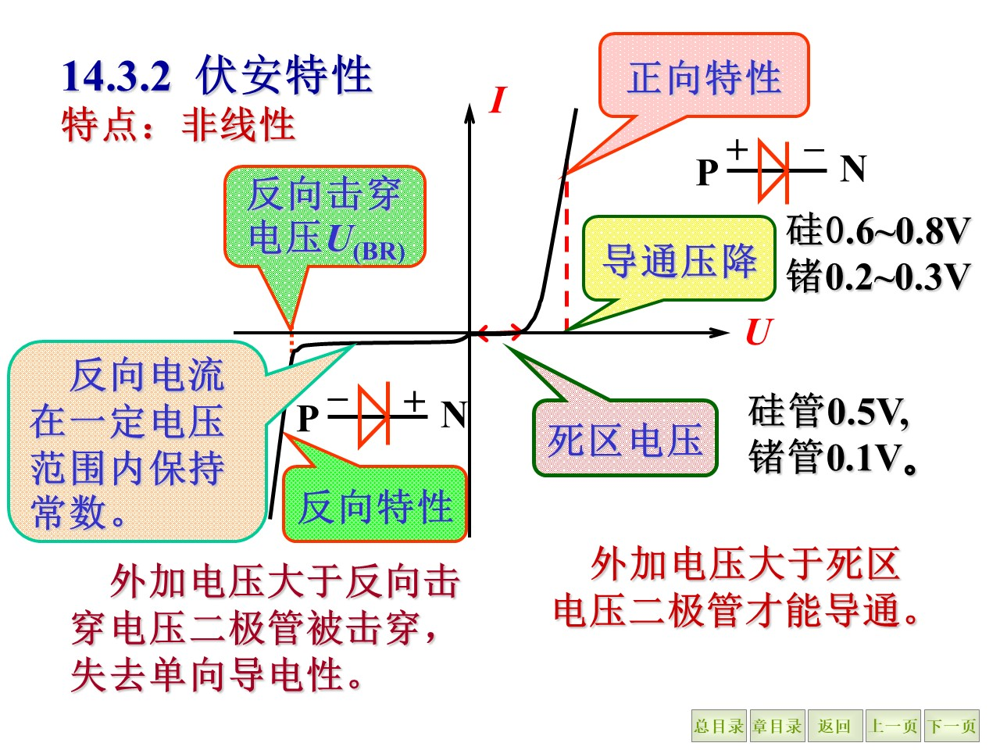
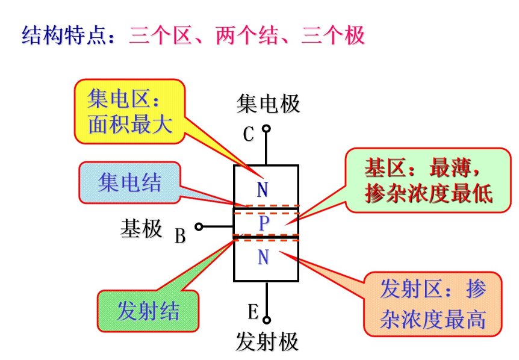

# 电路

## 电路基础

### 最基本的定律

欧姆定律：$U=IR$

电源的有载工作：$U=I(R+r)$， 其中$R$为电源内阻，$r$为负载电阻

功率和功率平衡：$P=UI=EI-R_0I^2$，其中$R_0$为电源内阻

### 基尔霍夫定律

- **KCL**：电路中任意一个节点的电流代数和为0，即$\sum\limits_{i=1}^n I_i=0$，其中$I_i$为流入节点的电流；
- **KVL**：电路中任意一个回路循行方向，回路中电压代数和为0，即$\sum\limits_{i=1}^n U_i=0$，其中$U_i$为沿着循行方向的电压

KCL推广：可以将电路中的某个部分看作一个节点，流入这个部分的电流等于流出这个部分的电流；
KVL的电流表示：$\sum E=\sum U_z = \sum IR$，其中$E$为电源电动势，$U_z$为电阻$R$两端的电压。
KVL推广：对于一个开路，开口电压$U$等于电源电动势$E-IR$。

使用基尔霍夫定律时，应先标注出电流电压的**参考方向**，然后按照参考方向写出方程，最后解方程。

电位的概念：电路中某点相对于参考点的电势差。

### 电路分析方法

一端口电路：将多个元件看作一个整体，只有两个端口与外部连接。如果两个一端口网络的端口处伏安特性相同，则这两个网络等效。

串联电路：$R=R_1+R_2+\dots+R_n$，$U=U_1+U_2+\dots+U_n$，$I=I_1=I_2=\dots=I_n$

并联电路：$\dfrac{1}{R}=\dfrac{1}{R_1}+\dfrac{1}{R_2}+\dots+\dfrac{1}{R_n}$，$U=U_1=U_2=\dots=U_n$，$I=I_1+I_2+\dots+I_n$

电压源模型：电压源与电阻串联，电压源的电压等于电源电动势，电阻等于电源内阻。

电流源模型：电流源与电阻并联，电流源的电流等于电源电流，电阻等于电源内阻。

二者的互相转化：对于一个电压源$E$内阻$R_0$与$R_L$串联，可视为一个电流源$I_s$内阻$R_0$与$R_L$并联，其中$I_s=\dfrac{E}{R_0}$即$E=I_sR_0$。

支路电流法：对于一个电路，将电路中的每个支路的电流都标注出来，然后根据基尔霍夫定律列出方程，最后解方程。一般来说，对于一个$n$个节点$b$条支路的电路，需要列出$n-1$个KCL方程，$b-n+1$个KVL方程，共$b$个方程，从而解出$b$个未知数（就是各个支路的电流）。

节点电压法：对于两个节点之间的若干支路，电流可通过基尔霍夫定律或者欧姆定律计算，再根据基尔霍夫定律，节点处的电流流入等于流出列方程。

### 电路定理

Thevenin 定理：任何线性电路都可以用一个电压源和一个串联电阻来等效。

叠加定理：线性电路中，各个电源分别作用时，电路中任意两点间的电压等于各个电源分别作用时，电路中任意两点间的电压的代数和。

叠加定理的使用：将电路中的电源分别作用，求出各个电源作用时的电路中任意两点间的电压，然后将这些电压代数和，即可得到电路中任意两点间的电压。具体来说，将所有不作用的电压源视为短路，所有不作用的电流源视为开路。

Norton 定理：任何线性电路都可以用一个电流源和一个并联电阻来等效。

Thevenin 定理的使用：将两个端口短路，求出两个端口处的电流，即可得到等效电流源的电流，然后将两个端口开路，求出两个端口处的电压，于是可得到等效电流源的内阻。

此外，还有非线性的电阻，伏安特性曲线$U=f(I)$不是一条直线，而是一条曲线，这样的电阻称为非线性电阻。

非线性电阻的分析需要指明工作电流和工作电压，$R=\frac U I$，其中$U$为工作电压，$I$为工作电流，事实上$R$就是在这个点函数$f$的导数，即$R=\dfrac{\mathrm{d}U}{\mathrm{d}I}$。

> （待补充）

### 几个常见的电路元件

#### 电阻

$$
\begin{gather}
R=\frac{u}{i}  \tag{r.1} \\
u=Ri \tag{r.2}
\end{gather}
$$

$(r.2)$式子两边乘以$i$并从$0$到$t$积分，得到：
$$
\int_0^t ui\mathrm{d}t=\int_0^t Ri^2\mathrm{d}t
$$
表明电能全部消耗在电阻上，即电阻是**耗能元件**。

#### 电感

$$
\begin{gather}
L=\frac{N\Phi}{i} \tag{l.1} \\
\end{gather}
$$

电感$L$的单位是亨利（Henry），$1H=1\frac{V\cdot s}{A}$，即$1H$的电感，当电流变化率为$1A/s$时，其两端电压为$1V$。磁通量$\Phi$的单位是韦伯（Weber），$1Wb=1\frac{V\cdot s}{m^2}$，即$1Wb$的磁通量，当磁场变化率为$1T/s$时，其面积为$1m^2$。

当电感元件的磁通量或者电流发生变化时，会产生电动势：

$$
e_L=-\frac{\mathrm{d}\Phi}{\mathrm{d}t}=-L\frac{\mathrm{d}i}{\mathrm{d}t}
$$

根据基尔霍夫定律：

$$
\begin{gather}
u+e_L=0 \notag \\
u=-e_L=L\frac{\mathrm{d}i}{\mathrm{d}t} \tag{l.2}
\end{gather}
$$

类似地，$(l.2)$两侧乘以$i$并从$0$到$t$积分，得到：

$$
\int_0^t ui\mathrm{d}t=\int_0^i Li\mathrm{d}i = \frac{1}{2}Li^2 \tag{l.3}
$$

可见得电流增大，磁场能量增大，电能转化为磁能，反之磁能转化为电能，也就是说电感不消耗能量，是**储能元件**。

#### 电容

$$
C=\frac{q}{u} \tag{c.1} \\
$$

电容$C$单位是法拉（Farad），$1F=1\frac{C}{V}$，即$1F$的电容，当电压变化率为$1V/s$时，其两端电荷为$1C$。

当电容元件的电荷量或电压发生变化时，会产生电流：

$$
i_C=\frac{\mathrm{d}q}{\mathrm{d}t}=C\frac{\mathrm{d}u}{\mathrm{d}t} \tag{c.2}
$$

（此式子中$u$和$i$参考方向相同）

将$(c.2)$式子两侧乘以$u$再从$0$到$t$积分，得到：

$$
\int_0^t i_Cu\mathrm{d}t=\int_0^u Cu\mathrm{d}u = \frac{1}{2}Cu^2 \tag{c.3}
$$

可见得电压增大，电场能量增大，电能转化为电场能量，反之电场能量转化为电能，也就是说电容不消耗能量，是**储能元件**。

> 此处的$L$、$C$、$R$可以理解为分别对应于机械系统中的质量$m$、弹簧常数$k$、阻尼系数$b$，三者在此处先规定为常数（实际情况更复杂）；$u$、$i$可以理解为分别对应于机械系统中的位移$x$、速度$v$。

> （本章内容下次补充，非考点范围的RC RL电路）

### 正弦交流电路

几个最基本的公式：

$$
\begin{gather}
f=\frac{1}{T} \notag \\
\omega=\frac{2\pi}{T}=2\pi f \notag
\end{gather}
$$

正弦电流的表示：

$$
i=I_m\sin(\omega t) \tag{ac.i.1}
$$

其中$I_m$为电流的最大值，也称为**峰值电流**，单位是安培（Ampere）；但是实际上，我们更多地使用**有效值**，即：

$$
\begin{align}
\int_0^T i^2R\mathrm{d}t&=I^2_{\mathrm{eff}}RT \\
I_{\mathrm{eff}} &=\sqrt{\frac{1}{T}\int_0^T i^2\mathrm{d}t} \\
&=\sqrt{\frac{1}{T}\int_0^T I_m^2\sin^2(\omega t)\mathrm{d}t} \\
&=\sqrt{\frac{1}{T}\int_0^T \frac{I_m^2}{2}(1-\cos(2\omega t))\mathrm{d}t} \\
&=\sqrt{\frac{I_m^2}{2T}\left(\int_0^T \mathrm{d}t-\int_0^T \cos(2\omega t)\mathrm{d}t\right)} \\
&=\sqrt{\frac{I_m^2}{2T}\left(T-0\right)} \\
&=\sqrt{\frac{I_m^2}{2}} \\
&=\frac{I_m}{\sqrt{2}} \tag{ac.i.2}
\end{align}
$$

类似地可以计算出

$$
u=U_m\sin(\omega t) \tag{ac.u.1}
$$

其中$U_m$为电压的最大值，也称为**峰值电压**，单位是伏特（Volt）；类似于上面的推导我们可以得出其**有效值**为:

$$
U_{\mathrm{eff}}=\frac{U_m}{\sqrt{2}} \tag{ac.u.2}
$$

相位和初相位：

$$
i=I_m\sin(\omega t+\psi)
$$

在这种情况下$i_0=I_m\sin\psi$，$\psi$称为**初相位**，单位是弧度（radian）；而$\omega t+\psi$称为**相位**，单位也是弧度。

正弦量的表示，根据欧拉公式：

$$
e^{j\theta}=\cos\theta+j\sin\theta
$$

可以将一个特定的正弦量表示为一个复数$A$：

$$
\begin{align}
A&=a+jb \\ &=rcos\psi+jrsin\psi =r(\cos\psi+j\sin\psi) \\ &=r\cdot e^{j\psi}
\end{align}
$$

或者简写为：

$$
A=r\phase{\psi}
$$

其中$r$称为**幅值**，$\psi$称为**相位**，$A$称为**复数**。

由于$\omega$已知在同一个电路中通常是相同的，我们只需要考虑初相位的差异，就可以通过复数表示正弦量，称为**相量**。

$$
\begin{gather}
\dot U = U(\cos\psi + j\sin\psi) = Ue^{j\psi} = U\phase{\psi} \tag{ac.u.3} \\
\dot I = I(\cos\psi + j\sin\psi) = Ie^{j\psi} = I\phase{\psi} \tag{ac.i.3}
\end{gather}
$$

注意这些标识，我们再来整理一下

| 量 | 瞬时值 | 有效值 | 峰值 | 相量 |
| --- | --- | --- | --- | --- |
| 电压 | $i$ | $U$ | $U_m$ | $\dot U$ |
| 电流 | $u$ | $I$ | $I_m$ | $\dot I$ |

这些标志在后面的分析中会经常用到，千万不要搞混了。

#### 电阻和交流电路

$$
\begin{align}
i =\frac{u}{R} &= \frac{U_m}{R}\sin(\omega t) = \sqrt{2}I\sin(\omega t) \tag{ac.r.1} \\
u=Ri &= RI_m\sin(\omega t) \notag \\&= \sqrt{2}RI\sin(\omega t)\tag{ac.r.2} \\&= \sqrt{2}\red{U}\sin(\omega t)\notag  \\
\end{align}
$$

由此可见：

1. 频率不变；
2. 大小关系为$U=RI$；
3. 相位关系为$\psi_u=\psi_i$，即相位差$\varphi=\psi_u-\psi_i=0$。
4. 相量关系$\dot U = U\phase{\psi_u} = RI\phase{\psi_i} = R\dot I$
5. 功率关系：

$$
\begin{align}
\text{瞬时功率}
p &= ui \\
&= \sqrt{2}Isin(\omega t) \cdot \sqrt{2}Usin(\omega t) \\
&= U_mI_m\sin^2(\omega t) \\
&= \frac{U_mI_m}{2}(1-\cos(2\omega t)) \geq 0 \\
\text{平均功率}
P&=\frac{1}{T}\int_0^T p\mathrm{d}t \\
&=\frac{U_mI_m}{2}\left(\frac{1}{T}\int_0^T \mathrm{d}t-\frac{1}{T}\int_0^T \cos(2\omega t)\mathrm{d}t\right) \\
&= \frac{U_mI_m}{2}\left(1-\frac{1}{T}\int_0^T \cos(2\omega t)\mathrm{d}t\right) \\
&= \frac{U_mI_m}{2} \\
&= UI = RI^2 = \frac{U^2}{R} \\
\end{align}
$$

#### 电感和交流电路

电感的电压电流关系为$u=L\frac{\mathrm{d}i}{\mathrm{d}t}$。代入$(ac.i.1)$，得到：

$$
\begin{align}
i&=I_m\sin(\omega t)=\sqrt{2}I\sin(\omega t) \tag{ac.l.1} \\
u&=L\frac{\mathrm{d}i}{\mathrm{d}t} \\
&= \omega LI_m\cos(\omega t) \\
&= \sqrt{2}\omega LI\cos(\omega t) \\
&= \sqrt{2}\omega LI\sin(\omega t+\frac{\pi}{2}) \tag{ac.l.2} \\
&= \sqrt{2}\red{U}\sin(\omega t+\frac{\pi}{2}) \\
\end{align}
$$

由此可见：

1. 频率不变；
2. 有效值的关系：$U=I\omega L$或者$I=\frac{U}{\omega L}$；
3. 电压超前电流$\frac{\pi}{2}$，即$\psi_u=\psi_i+\frac{\pi}{2}$，即相位差$\varphi=\psi_u-\psi_i=\frac{\pi}{2}$。

**感抗**：$X_L=\omega L = 2\pi fL$

则有$U = X_LI$；

注意，感抗只是电压和电流的幅值或者有效值之比，不是瞬时值之比，即$\frac{u}{i}\neq X_L$，事实上电压和电流成导数关系，即$u=X_L\frac{\mathrm{d}i}{\mathrm{d}t} = XI_m\sin(\omega t+\frac{\pi}{2})$。

那么，对于相量，$\dot U = Ue^{j \frac{\pi}{2}}$，$\dot I = Ie^{j 0}$：

$$
\begin{align}
\frac{\dot U}{\dot I} &= \frac{Ue^{j \cdot \frac{\pi}{2}}}{Ie^{j \cdot 0}} \\
&= \frac{U}{I}e^{j\cdot \frac{\pi}{2}} \\
&= jX_L \\
\dot U &= j\dot I X_L \\
&= j\dot I \omega L \\
\end{align}
$$

功率的计算：

$$
\begin{align}
\text{瞬时功率}
p &= ui \\
&= \sqrt{2}I\sin(\omega t) \cdot \sqrt{2}U\sin(\omega t+\frac{\pi}{2}) \\
&=2UI\sin(\omega t)\cos(\omega t) \\
&= UI\sin(2\omega t) \\
\text{平均功率}
P&=\frac{1}{T}\int_0^T p\mathrm{d}t \\
&=\frac{UI}{2}\left(\frac{1}{T}\int_0^T \sin(2\omega t)\mathrm{d}t\right) \\
&= 0 \\
\end{align}
$$

由于电感不消耗能量，所以平均功率为0，只有电源和电感元件之间的能量转化，我们将这种能量转化的规模用**无功功率**（瞬时功率的幅值）来表示，即：

$$
Q=UI = \frac{U^2}{X_L} = X_LI^2
$$

单位为伏特安培乘以秒，即瓦特秒（Watt second），也称为**乏**（Var）。

#### 电容和交流电路

电容的电压电流关系为$i=C\frac{\mathrm{d}u}{\mathrm{d}t}$。代入$(ac.u.1)$，得到：

$$
\begin{align}
u&=U_m\sin(\omega t)=\sqrt{2}U\sin(\omega t) \tag{ac.c.1} \\
i&=C\frac{\mathrm{d}u}{\mathrm{d}t} \\
&= \omega CU_m\cos(\omega t) \\
&= \sqrt{2}\omega CU\cos(\omega t) \\
&= \sqrt{2}\omega CU\sin(\omega t+\frac{\pi}{2}) \tag{ac.c.2} \\
&= \sqrt{2}\red{I}\sin(\omega t+\frac{\pi}{2}) \\
\end{align}
$$

由此可见：

1. 频率不变；
2. 有效值的关系：$I=\omega CU$或者$U=\frac{I}{\omega C}$；
3. 电流超前电压$\frac{\pi}{2}$，即$\psi_i=\psi_u+\frac{\pi}{2}$，即相位差$\varphi=\psi_u-\psi_i=-\frac{\pi}{2}$。

**容抗**：$X_C=\frac{1}{\omega C} = \frac{1}{2\pi fC}$

则有$U = \frac{I}{X_C}$；

注意，容抗只是电压和电流的幅值或者有效值之比，不是瞬时值之比，即$\frac{u}{i}\neq X_C$，事实上电流和电压成导数关系，即$i=X_C\frac{\mathrm{d}u}{\mathrm{d}t} = XI_m\sin(\omega t+\frac{\pi}{2})$。

那么，对于相量，$\dot U = Ue^{j \frac{\pi}{2}}$，$\dot I = Ie^{j 0}$：

$$
\begin{align}
\frac{\dot U}{\dot I} &= \frac{Ue^{j \cdot \frac{\pi}{2}}}{Ie^{j \cdot 0}} \\
&= \frac{U}{I}e^{j\cdot \frac{\pi}{2}} \\
&= -jX_C \\
\dot U &= -j\dot I X_C \\
&= -j \frac{\dot I}{\omega C} \\
&= \frac{\dot I}{j\omega C}
\end{align}
$$

功率的计算：

$$
\begin{align}
\text{瞬时功率}
p &= ui \\
&= \sqrt{2}I\sin(\omega t+\frac{\pi}{2}) \cdot \sqrt{2}U\sin(\omega t) \\
&=2UI\sin(\omega t+\frac{\pi}{2})\cos(\omega t) \\
&= -UI\sin(2\omega t) \\
\text{平均功率}
P&=\frac{1}{T}\int_0^T p\mathrm{d}t \\
&=\frac{UI}{2}\left(\frac{1}{T}\int_0^T -\sin(2\omega t)\mathrm{d}t\right) \\
&= 0 \\
\text{无功功率}
Q&=-UI = -\frac{U^2}{X_C} = -X_CI^2
\end{align}
$$

#### 上述三种元器件的串联

##### 分压关系和阻抗三角形、电压三角形

假设一个电路有一个电阻$R$，一个电感$L$，一个电容$C$，并联在一起，电压为$u$，电流为$i$，则有：

$$
\begin{align}
u&=Ri+L\frac{\mathrm{d}i}{\mathrm{d}t}+\frac{1}{C}\int i\mathrm{d}t \\
\dot U &= R\dot I + j\omega L\dot I + \frac{\dot I}{j\omega C} \\
&= \dot I\left[R+j\left(X_L-X_C\right)\right] \\
\end{align}
$$

将式子里面的$R+j\left(X_L-X_C\right)$记为$Z$，则有：

$$
\begin{align}
Z &= R+j\left(X_L-X_C\right) \\
&= \sqrt{R^2+\left(X_L-X_C\right)^2}e^{j\cdot\arctan\frac{X_L-X_C}{R}} \\
&= \red{|Z|}e^{j\red\varphi} \\
\end{align}
$$

其中$|Z|$称为**阻抗模**，$\frac{U}{I} = \sqrt{R^2+\left(X_L-X_C\right)^2} = |Z|$，单位为欧姆（Ohm）；$\varphi$称为**阻抗的幅角**，$\varphi = \arctan\frac{X_L-X_C}{R}$，单位为弧度，即电流和电压的相位差。

> 可以将阻抗的复数形式理解为，实部为“阻”，虚部为“抗”，即阻抗的实部为电阻，虚部为电抗，电抗有两种，一种是感抗，一种是容抗；既表示了大小关系$|Z|$，也表示了相位关系$\varphi$。

##### 功率的计算与功率三角形

$$
\begin{align}
\text{对于} \\
i&=I_m\sin(\omega t) \\
u&=U_m\sin(\omega t+\varphi) \\
\text{瞬时功率}
p &= ui \\
&= U_mI_m\sin(\omega t+\varphi)\sin(\omega t) \\
&= UI\cos(\varphi) - UI \cos(2\omega t+\varphi) \\
\text{平均功率}
P&=\frac{1}{T}\int_0^T p\mathrm{d}t \\
&= \frac{1}{T} \int_0^T \left[UI\cos(\varphi) - UI \cos(2\omega t+\varphi)\right] \mathrm{d}t \\
&= \frac{1}{T} \left[UI\cos(\varphi)\int_0^T \mathrm{d}t - UI \int_0^T \cos(2\omega t+\varphi)\mathrm{d}t\right] \\
&= \frac{1}{T} \left[UI\cos(\varphi)T-0\right] \\
&= UI\cos\varphi \\
\text{无功功率}
Q&=U_LI-U_CI = X_LI^2-X_CI^2 = |Z|I^2\sin\varphi = UI\sin\varphi
\end{align}
$$

可见，功率不仅与电源（发电机）的端电压和输出电流的有效值的乘积有关，还与负载的参数有关（因为负载会影响到$\varphi$），我们称$\cos(\varphi)$为**功率因数** 。

定义**视在功率**： $S=UI=|Z|I^2$

如果用直角三角形描述这个功率的关系，可以得到：

#### 阻抗的串并联

##### 串联

$$
Z = \sum Z_k = \sum R_k + j \sum X_k =|Z|e^{j\varphi} = |Z|\phase{\varphi}
$$

##### 并联

$$
\frac{1}{Z} = \sum \frac{1}{Z_k}
$$

### 三相交流电

三相电压频率相同、相位差为 $\frac{2\pi}{3}$ 的三个正弦电压称为**三相电压**，三相电压的有效值相等，称为**对称三相电压**。

三相电路的连接方式分为：

1. 星形连接（Y形连接）
2. 三角形连接

#### 相电压与线电压

发电机通常使用星形连接，即将三个末端连在一起，这个点称为**中性点**，中性点引出的导线称为**中性线**（或者**零线**），从始端引出的三根导线称为**相线**或者**端线**（俗称**火线**），中性线与任意一个相线的电压称为**相电压**，相电压的有效值一般记作$U_P$；任意两端间的电压称为**线电压**，线电压的有效值为$U_L$。

用相量表示相电压和线电压：

$$
\begin{align}
\dot U_{12} = \dot U_1 - \dot U_2 \\
\dot U_{23} = \dot U_2 - \dot U_3 \\
\dot U_{31} = \dot U_3 - \dot U_1 \\
\end{align}
$$

容易求出，相电压的矢量差为线电压，线电压超前于相电压 $\frac{\pi}{6}$，并且有效值的大小关系为：

$$
\begin{align}
U_P = \frac{U_L}{\sqrt{3}} \\
U_L = \sqrt{3}U_P
\end{align}
$$

在中国大陆地区，三相电压的有效值为 $220V$，线电压的有效值为 $380V \approx \sqrt{3} \times 220$。

#### 负载星形连结

在三相四线制中，很显然相电流和线电流是相同的。

设电源的相电压分别为$\dot U_1 = U_1 \phase 0^\circ$，$\dot U_2 = U_2 \phase{-120^\circ}$，$\dot U_3 = U_3 \phase{120^\circ}$，负载的阻抗分别为$\dot Z_1 = Z_1 \phase{\varphi_1}$，$\dot Z_2 = Z_2 \phase{\varphi_2}$，$\dot Z_3 = Z_3 \phase{\varphi_3}$，则三个相电流的相量为：

$$
\begin{align}
\dot I_1 &= \frac{\dot U_1}{\dot Z_1} = \frac{U_1}{|Z_1|} \phase{-\varphi_1} \\
\dot I_2 &= \frac{\dot U_2}{\dot Z_2} = \frac{U_2}{|Z_2|} \phase{-120^\circ-\varphi_2} \\
\dot I_3 &= \frac{\dot U_3}{\dot Z_3} = \frac{U_3}{|Z_3|} \phase{120^\circ-\varphi_3} \\
\text{其中} \\
\varphi_1 &= \arctan \frac{X_1}{R_1} \\
\varphi_2 &= \arctan \frac{X_2}{R_2} \\
\varphi_3 &= \arctan \frac{X_3}{R_3} \\
\end{align}
$$

中性线的电流$\dot I_N = \dot I_1 + \dot I_2 + \dot I_3$。

当**负载均衡**时，即$Z_1 = Z_2 = Z_3$，则$\varphi_1 = \varphi_2 = \varphi_3$，此时中性线的电流为零。

这个时候中性线就可以被拆除，这样就可以节省一根导线，这种连接方式称为**三相三线制**。这种情况一般见于对称的三相负载，比如三相电机。

对于**负载不均衡**的情况，使用相量分别计算即可。

当出现负载短路时，考虑到短路处的电流过大导致熔断，此时这个支路其实断开而其他支路不受影响；对于中性线断开的情况（或者说三相三线制），未短路的两个支路相当于串联接在了线电压上。

#### 负载三角形连结

三角形连结是指将三个负载分别连接在三相电源的三个相线上。

各相负载的电流有效值为：

$$
\begin{align}
I_{12} &= \frac{U_{12}}{|Z_{12}|} \\
I_{23} &= \frac{U_{23}}{|Z_{23}|} \\
I_{31} &= \frac{U_{31}}{|Z_{31}|} \\
\end{align}
$$

相位差：

$$
\begin{align}
\varphi_{12} &= \frac{X_{12}}{R_{12}} \\
\varphi_{23} &= \frac{X_{23}}{R_{23}} \\
\varphi_{31} &= \frac{X_{31}}{R_{31}} \\
\end{align}
$$

负载的线电流根据基尔霍夫定律，有：

$$
\begin{align}
\dot I_1 &= \dot I_{12} - \dot I_{31} \\
\dot I_2 &= \dot I_{23} - \dot I_{12} \\
\dot I_3 &= \dot I_{31} - \dot I_{23} \\
\end{align}
$$

当负载均衡时，即$Z_{12} = Z_{23} = Z_{31}$，则$\varphi_{12} = \varphi_{23} = \varphi_{31}$，此时：

$$I_{12} = I_{23} = I_{31} = I_P = \frac{U_P}{|Z|}$$

$$\varphi_{12} = \varphi_{23} = \varphi_{31} = \varphi = \arctan\frac{X}{R}$$

此时，线电流和相电流的关系为：

- 线电流相位比相电流滞后 $\frac{\pi}{6}$
- 大小关系：$I_L = \sqrt{3}I_P$

#### 功率

总功率是三个相功率之和，当负载均衡时，三个相功率相等：

$$
P = 3 P_P = 3 U_P I_P \cos \varphi \tag{ac.3.P.1}
$$

- 负载星形连结时

$$ U_L = \sqrt{3} U_P \qquad I_L = \sqrt{3} I_P $$

- 负载三角形连结时

$$ U_L = U_P \qquad I_L = \sqrt{3} I_P $$

代入 $(ac.3.P.1)$ 式，得到：

$$
P = \sqrt{3} U_L I_L \cos \varphi \tag{ac.3.P.2}
$$

同理，视在功率和无功功率也可以得到类似的关系：

$$
\begin{align}
S &= \sqrt{3} U_L I_L \\
Q &= \sqrt{3} U_L I_L \sin \varphi
\end{align}
$$

#### 交流电的小结

- 相电压（$U_P$）的有效值相等，称为对称三相电压
- 三相电路的连接方式分为星形连接（Y形连接）和三角形连接
- Y连接时三相电压的相量差为线电压（$U_L$），线电压超前于相电压 $\frac{\pi}{6}$，并且有效值的大小关系为：$U_P = \frac{U_L}{\sqrt{3}}$；相电流和线电流相等
- 负载Y形连接，就是三相四线制；负载均衡时，三相电路的中性线电流为零，此时可以拆除中性线，这种连接方式称为三相三线制
- 负载三角形连接，三相电路的线电流和相电流的关系为：$I_L = \sqrt{3} I_P$，线电流相位比相电流滞后 $\frac{\pi}{6}$

### 磁路

#### 基本物理量

- 磁感应强度：$B$，单位：$T$（特斯拉）
- 磁通量：$\Phi=BS$，单位：$Wb$（韦伯）
- 磁场强度：$H=\frac{B}{\mu}$，单位：$A/m$（安培/米）
- 磁导率：$\mu=\frac{B}{H}$，单位：$H/m$（亨利/米）
- 真空磁导率：$\mu_0=4\pi \times 10^{-7} H/m$；
  相对磁导率：$\mu_r=\frac{\mu}{\mu_0}=\frac{B}{B_0}$

#### 安培环路定理

$$
\oint \vec H \cdot \mathrm d \vec l = \sum \vec H \cdot \mathrm d \vec l = NI
$$

即，磁场强度沿闭合回路的线积分等于回路上的电流的代数和。

#### 磁饱和与磁滞性

磁饱和：当磁场强度增加时，磁感应强度不再增加，称为磁饱和。

磁滞性：磁滞性是指材料中磁感应强度总是滞后于外磁场强度的变化的性质。

根据磁性能，磁性材料分为：

- 软磁材料：磁滞回线较窄，矫顽磁力较小
- 永磁材料：磁滞回线较宽，矫顽磁力较大
- 矩磁材料：磁滞回线近乎矩形，剩磁大，矫顽磁力小，稳定性良好。

#### 电磁关系

主磁通$\Phi$、漏磁通$\Phi_\sigma$与电动势的关系：

$$
\begin{gather}
e=-N\frac{\mathrm d \Phi}{\mathrm d t} \tag{ac.4.1} \\
e_\sigma = -N\frac{\mathrm d \Phi}{\mathrm d t} \tag{ac.4.2}
\end{gather}
$$

根据KVL：

$$
u=Ri-e-e_\sigma \tag{ac.4.3}
$$

其中 $R$ 为线圈导线的电阻。

如果忽略电阻和漏磁通，

$$
\begin{align}
\dot U&=R\dot I-\dot E-\dot E_\sigma \\
&\approx - \dot E
\end{align}
$$

功率损耗：

- 铜损：$P_{Cu}=RI^2$

  其中 $R$ 为线圈导线的电阻，$I$ 为线圈电流的有效值。
- 铁损：$P_{Fe}=K_f\Phi^2$
  - 铁损中的磁滞损耗：$\Delta P_h$
  - 铁损中的涡流损耗：$\Delta P_e$

### 变压器

#### 电压变换关系

$$E_1 = \frac{ {E_1}_m}{\sqrt{2}} = \frac{2\pi f N_1 \Phi_m}{\sqrt{2} } = 4.44 f N_1 \Phi_m$$

同理，$E_2 = 4.44 f N_2 \Phi_m$。

根据KVL：

$$
\begin{align}
\dot U_1 &= R_1\dot I_1 -\dot E_{\sigma 1} - \dot E_1 \approx - \dot E_1 \\
U_1 &\approx E_1 = 4.44 f N_1 \Phi_m \\
\dot E_2 &= R_2\dot I_2 -\dot E_{\sigma 2} + \dot U_2 \\
\text {当变压器空载时，} \dot I_2 &= 0 \\
U_{20} = U_2 &= \dot E_2 = 4.44 f N_2 \Phi_m
\end{align}
$$

匝比（变比）：

$$
\frac{U_1}{U_{20}} \approx \frac{E_1}{E_2} = \frac{N_1}{N_2} = K
$$

#### 三相变压器的 $Y$ / $Y_0$ 连接

线电压之比也等于匝比：

$$
\frac{U_{1}}{U_{2}} = \frac{\sqrt{3}{U_P}_1}{\sqrt{3}{U_P}_2} = K
$$

#### 三相变压器的 $Y_0$ / $\Delta$ 连接

线电压之比：

$$
\frac{U_{1}}{U_{2}} = \frac{\sqrt{3}U_{P1}}{U_{P2}} = \sqrt{3}K
$$

#### 电流变换

结论：变压器的电流变换比等于电压变换比的倒数$\frac{1}{K}$。

#### 阻抗变换

电压为$K$倍，电流为$\frac{1}{K}$倍，阻抗为$K^2$倍。

#### 变压器型号

例子：SJL-1000/10，其中：

- S：三相（D：单相）
- J：油浸自冷式
- L：铝线圈
- 1000：额定容量为$1000kVA$
- 10：高压绕组的额定电压为$10kV$

#### 额定值

- 额定电压${U_1}_N$、${U_2}_N$：
  - 单相：${U_1}_N$，一次侧的电压；${U_2}_N$，二次侧的空载的电压
  - 三相：${U_1}_N$，一次侧的线电压；${U_2}_N$，二次侧的线电压
- 额定电流${I_1}_N$、${I_2}_N$：
  - 单相：${I_1}_N$，一次侧的电流；${I_2}_N$，二次侧的电流
  - 三相：${I_1}_N$，一次侧的线电流；${I_2}_N$，二次侧的线电流
- 额定容量$S_N$：
  - 单相：$S_N = {U_2}_N {I_2}_N \approx {U_1}_N {I_1}_N$
  - 三相：$S_N = \sqrt{3} {U_2}_N {I_2}_N \approx \sqrt{3} {U_1}_N {I_1}_N$

  输出功率$P_2 = U_2 I_2 \cos \varphi_2$，其中$\varphi_2$为二次侧的功率因数。

  一次侧的输入功率$P_1 = P_2 + P_{Fe} + P_{Cu}$，其中$P_{Fe}$为铁损，$P_{Cu}$为铜损。

  $\eta = \frac{P_2}{P_1}$，称为变压器的效率，一般$\eta > 0.95$；负载在额定容量的$50~75\%$时，效率最高。

- 额定频率$f_N$：$50Hz$或者$60Hz$

#### 特殊变压器

- 自耦变压器：一次侧和二次侧共用一部分线圈，一般用于降压
- 电流互感器：一般用于测量电流

### 交流电动机

#### 旋转磁场

定子三相绕组通入三相交流电。三相交流电的相位差为 $\frac{2\pi}{3}$，这个相位差导致了连接在三相绕组的三个线圈相位有规律的变化，可以视为是在“旋转”，因此导致了内部转子跟着旋转起来。就是说定子没有转，但是电流在周期性变化，就和“电流不变而定子在转”等效。

如果需要调节电机的旋转方向，就需要对其两根进线进行调换，这样形成的磁场和调换之前的恰好相反，也就使得电机能反转。

旋转磁场的极对数$P$与三相绕组的排列有关。转速与极对数的关系：

$$
n_0=\frac{60f_1}{p}
$$

单位：转/分

#### 转差率

电动机转子和磁场旋转方向一致，但是$n < n_0$，这个差值称为转差率，这是因为转子的转动是磁通切割转子的导条，这个前提就是二者不是完全同步的。转差率：

$$
s=\left(\frac{n_0-n}{n_0}\right) \times 100\%
$$

也可以写作：$n=(1-s)n_0$

异步电机运行中，一般$s=(1\sim 9)\%$。

#### 含三相异步电机的电路分析

三相异步电机的电磁关系和变压器类似。

旋转磁场的磁通$\Phi$：

$$
\begin{gather}
U_1 \approx E_1 = 4.44 f_1 N_1 \Phi \notag\\
\Phi \approx \frac{U_1}{4.44 f_1 N_1} \notag
\end{gather}
$$

定子感应电动势的频率（等于电源的频率）：

$$f_1=\frac{pn_0}{60}$$

转子的感应电动势频率：

$$f_2 = \frac{n_0-n}{60} p =sf_1 \neq f_1$$

转子感应电动势：

$$E_2 = 4.44 f_2 N_2 \Phi = 4.44 sf_1 N_2 \Phi$$

当转速$n=0$ 时，$f_2$最大，此时$E_2$最大，记为$E_{20}$，即：

$$
\begin{gather}
E_{20} = 4.44 f_1 N_2 \Phi \notag\\
E_2 = sE_{20} \notag
\end{gather}
$$

转子的感抗$X_2$：

$$
X_2 = 2\pi f_2 L_{\sigma 2} = 2 \pi sf_1 L_{\sigma 2}
$$

类似的，$n=0$ 时，$X_2$最大，记为$X_{20}$，即：

$$
\begin{gather}
X_{20} = 2 \pi f_1 L_{\sigma 2} \notag\\
X_2 = sX_{20} \notag
\end{gather}
$$

转子电流：

$$
\begin{align*}
I_2 = \frac {E_2}{\sqrt{R_2^2 + X_2^2}} = \frac{sE_{20}}{\sqrt{R_2^2 + s^2X_{20}^2}} \\
\left \lbrace \begin{aligned} s&=0 \rightarrow I_2 = 0 (n=n_0) \\ s&=1 \rightarrow I_2 = \frac{E_{20}}{\sqrt{R_2^2 + X_{20}^2}} (n=0) \end{aligned} \right.
\end{align*}
$$

功率因素：

$$
\cos \psi_2 = \frac{R_2}{\sqrt{R_2^2 + X_2^2}} = \frac{sX_{20}}{\sqrt{R_2^2 + s^2X_{20}^2}}
$$

- 当$s$很小时，$\cos \varphi_2 \approx 1$，功率因数接近于1，电机效率高；
- 当$s$很大时，$\cos \varphi_2 \propto \frac{1}{s}$，电机效率低。

我们分析可知，这上面的所有物理量都与转差率，或者说与转速有关

#### 转矩

转矩公式

$$
T=K_T I_2 \Phi \cos(\psi_2) = K \frac{sR_2}{R_2^2 + s^2X_{20}^2} U_1 ^2 \tag{ac.5.1}
$$

- 额定转矩$T_N$：
  $$T =  \frac{P}{\frac{2\pi n}{60}} = 9550 \frac{P}{n}$$
  那么额定转矩$T_N = 9550 \frac {P_N}{n_N}$ 单位：$N \cdot m$
- 最大转矩$T_{max}$：
  令$\frac{\mathrm d T}{\mathrm d s} = 0$，得到$S=S_m = \frac{R_2}{X_20}$，代入转矩公式
  $$
  T_{max} = K \frac{U_1^2}{2X_{20} }
  $$
  负载转矩不得大于最大转矩，否则堵转。
- 过载系数
  $$
  \lambda = \frac{T_{max} }{T_N}
  $$
  一般$\lambda$在1.8~2.2
- 起动转矩$T_{st}$
  起动时$n=0$，$s=1$，代入转矩公式，
  $$
  T_{st} = K \frac{R_2 U_1^2}{R_2^2 + X_{20}^2}
  $$
  若$T_{st} > T_2$则电动机可以起动，否则不能。
- 起动能力
  $$
  K_{st} = \frac{T_{st} }{T_N}
  $$

转矩平衡条件：

- 转子轴上的转矩$T_2 = T - T_0$，其中$T_0$为转子的机械转矩
- 空载转矩：$T_0$
- 输出转矩：$T_2 = T - T_0 \approx T$
- 负载转矩：$T_Z$
  - 当$T_Z = T_2$时，电动机处于稳定转速
  - 当$T_Z > T_2$时，电动机加速
  - 当$T_Z < T_2$时，电动机减速

负载对电动机运行的影响：电动机的电磁转矩随负载变化自动调整，称为自适应负载能力。

$U_1$对机械特性的影响：随着$U_1$减小，$T_{max}$减小，$T_{st}$减小。

#### 起动

- 直接起动：
  电动机的起动电流很大，会导致电网电压下降，影响其他设备的正常运行，因此不常用。
- 降压启动：
  通过星形-三角形换接，或者自耦降压
- 转子串电阻起动：
  绕线式电机

#### 降压启动

##### 星形-三角形换接

三角形连结时，$I_{l\Delta } = \sqrt{3}\frac{U_l}{Z}$

星形连结时，$I_{lY} = \frac{U_l}{\sqrt{3}Z}$

因此，降压起动，电流为三分之一

类似地，$T_{stY} = \frac{1}{3}T_{st\Delta}$

- 仅适用于正常运行为三角形连结的电动机
- 换接适用于轻载或者空载

##### 自耦降压起动

- 适用于容量大、或者正常运行时为Y连结而不能使用$Y-\Delta$起动的鼠笼式异步电动机

#### 电机调速

- 无极调速：改变电源频率
- 变极调速：改变极对数$P$，改变电机的转速

#### 制动

- 能耗制动：断开交流电流，通入直流电流
- 反接制动：将电动机的两根进线交换，使得电动机反转，此时电动机的转矩方向与负载转矩方向相反，从而实现制动
- 发电反馈制动：电动机转子速度大于旋转磁场速度，驱动转矩变为制动转矩

#### 铭牌数据

例子：Y132M-4，其中：

- Y：三相异步电动机
- 132：基座中心高，单位：$mm$
- M：基座长度代号，单位：$mm$
- 4：磁极数（极对数的两倍）

> 其他内容参考课本，这里不再赘述。

## 模拟电路

### 半导体器件

#### 本证半导体、杂质半导体和PN结

本征半导体：在半导体中，每个原子都有四个价电子，当半导体中的原子数目足够多时，每个原子都可以与四个相邻原子共享一个价电子，形成共价键，这样的半导体称为本征半导体。

杂质半导体：在半导体中，掺入少量杂质，使得半导体中的原子数目不足以与相邻原子共享四个价电子，这样的半导体称为杂质半导体。分为N型半导体和P型半导体。

N型半导体：掺入的杂质原子有五个价电子（如磷、砷、锑），其中四个价电子与相邻原子共享，而剩下的一个价电子处于自由状态，这样的半导体称为N型半导体。

P型半导体：掺入的杂质原子有三个价电子（如硼、镓、铟），其中三个价电子与相邻原子共享，而剩下的一个价电子处于缺电子状态，这样的半导体称为P型半导体。

PN结：将N型半导体和P型半导体的晶体片背靠背地粘合在一起，使得P型半导体中的自由电子与N型半导体中的空穴结合，形成一个电子云，这样的结构称为PN结。

PN结具有单向导电性，当 P 接入正电压，N 接入负电压时，正向电流较大、电阻较小，为导通状态（正向偏置）；当 P 接入负电压，N 接入正电压时，正向电流较小、电阻较大，为截止状态（反向偏置）。

温度越高，反向电流越大。

二极管分为：点接触型、面接触型、平面型。

#### 二极管的伏安特性

主要参数：

- 最大整流电流$I_{OM}$：允许流过二极管的最大正向电流。
- 反向工作峰值电压$U_{RWM}$：保证二极管在反向工作时不会击穿的最大反向电压。
- 最大反向电流$I_{RM}$：二极管加最高反向电压时的反向电流。

#### 二极管小结

- 正向偏置：正向导通，正向的电阻较小，正向的电流较大
- 反向偏置：反向截止，反向的电阻较大，反向的电流较小
- 反向击穿：反向电压超过反向工作峰值电压时，二极管会击穿，反向电流急剧增大，二极管会被烧毁

二极管的反向电流受温度影响较大，温度越高反向电流越大。

对于理想二极管，正向导通的时候压降为0，反向截止的时候二极管相当于断开。

二极管的分析方法：将其视为断路，比较两侧的电势。

#### 稳压二极管

文雅二极管在工作时加反向电压。工作状态为反向击穿，此时电压变化很小但是电流变化较大，使用时应加限流电阻。

主要参数：

- 稳定电压$U_Z$：稳压二极管在工作时（反向击穿）的电压。
- 电压温度系数$\alpha_U$：环境温度每变化 1 开尔文，稳压二极管的稳定电压变化的百分比。
- 动态电阻$r_z = \frac{\Delta U_Z}{\Delta I_Z}$：稳压二极管在工作时的动态电阻，$r_Z$ 越小，稳压性能越好。
- 最大稳定电流$I_{ZM}$、稳定电流$I_Z$
- 最大允许耗散功率$P_{ZM} = U_Z I_{ZM}$

### 三极管

#### 三极管的结构

- NPN 三极管：P 型半导体夹在两个 N 型半导体之间
- PNP 三极管：N 型半导体夹在两个 P 型半导体之间

#### 三极管电流分配和放大原理

外部条件：发射结正向偏置，集电结反向偏置。