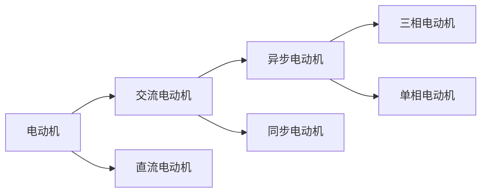
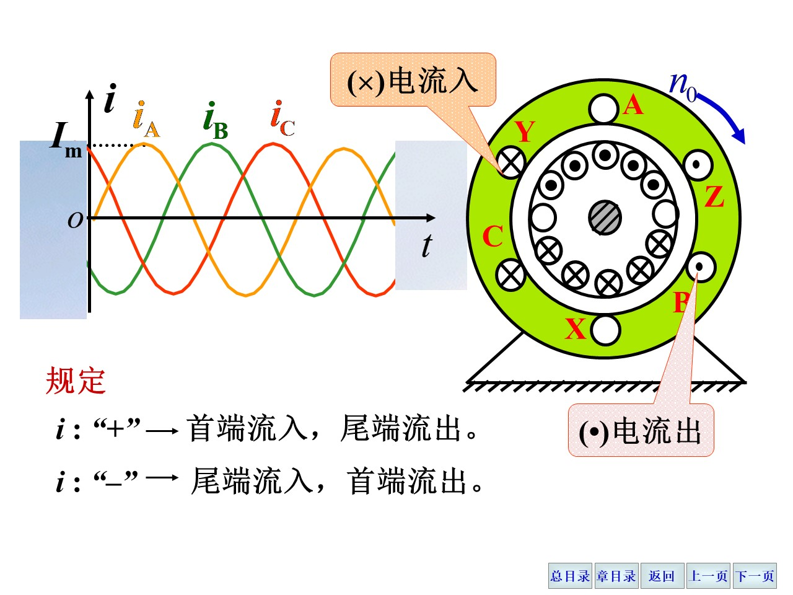
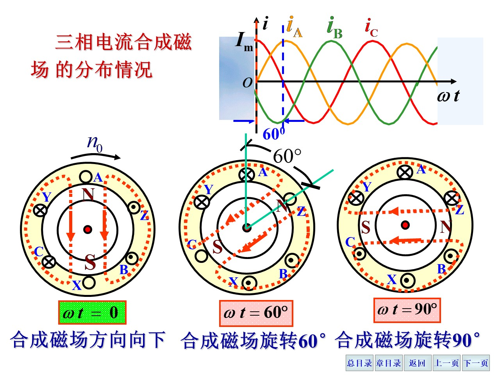

# 交流电和

## 三相交流电

三相电压频率相同、相位差为 $\frac{2\pi}{3}$ 的三个正弦电压称为**三相电压**，三相电压的有效值相等，称为**对称三相电压**。

三相电路的连接方式分为：

1. 星形连接（Y形连接）
2. 三角形连接

### 相电压与线电压

发电机通常使用星形连接，即将三个末端连在一起，这个点称为**中性点**，中性点引出的导线称为**中性线**（或者**零线**），从始端引出的三根导线称为**相线**或者**端线**（俗称**火线**），中性线与任意一个相线的电压称为**相电压**，相电压的有效值一般记作$U_P$；任意两端间的电压称为**线电压**，线电压的有效值为$U_L$。

用相量表示相电压和线电压：

$$
\begin{align}
\dot U_{12} = \dot U_1 - \dot U_2 \\
\dot U_{23} = \dot U_2 - \dot U_3 \\
\dot U_{31} = \dot U_3 - \dot U_1 \\
\end{align}
$$

容易求出，相电压的矢量差为线电压，线电压超前于相电压 $\frac{\pi}{6}$，并且有效值的大小关系为：

$$
\begin{align}
U_P = \frac{U_L}{\sqrt{3}} \\
U_L = \sqrt{3}U_P
\end{align}
$$

在中国大陆地区，三相电压的有效值为 $220V$，线电压的有效值为 $380V \approx \sqrt{3} \times 220$。

### 负载星形连结

在三相四线制中，很显然相电流和线电流是相同的。

设电源的相电压分别为$\dot U_1 = U_1 \phase 0^\circ$，$\dot U_2 = U_2 \phase{-120^\circ}$，$\dot U_3 = U_3 \phase{120^\circ}$，负载的阻抗分别为$\dot Z_1 = Z_1 \phase{\varphi_1}$，$\dot Z_2 = Z_2 \phase{\varphi_2}$，$\dot Z_3 = Z_3 \phase{\varphi_3}$，则三个相电流的相量为：

$$
\begin{align}
\dot I_1 &= \frac{\dot U_1}{\dot Z_1} = \frac{U_1}{|Z_1|} \phase{-\varphi_1} \\
\dot I_2 &= \frac{\dot U_2}{\dot Z_2} = \frac{U_2}{|Z_2|} \phase{-120^\circ-\varphi_2} \\
\dot I_3 &= \frac{\dot U_3}{\dot Z_3} = \frac{U_3}{|Z_3|} \phase{120^\circ-\varphi_3} \\
\text{其中} \\
\varphi_1 &= \arctan \frac{X_1}{R_1} \\
\varphi_2 &= \arctan \frac{X_2}{R_2} \\
\varphi_3 &= \arctan \frac{X_3}{R_3} \\
\end{align}
$$

中性线的电流$\dot I_N = \dot I_1 + \dot I_2 + \dot I_3$。

当**负载均衡**时，即$Z_1 = Z_2 = Z_3$，则$\varphi_1 = \varphi_2 = \varphi_3$，此时中性线的电流为零。

这个时候中性线就可以被拆除，这样就可以节省一根导线，这种连接方式称为**三相三线制**。这种情况一般见于对称的三相负载，比如三相电机。

对于**负载不均衡**的情况，使用相量分别计算即可。

当出现负载短路时，考虑到短路处的电流过大导致熔断，此时这个支路其实断开而其他支路不受影响；对于中性线断开的情况（或者说三相三线制），未短路的两个支路相当于串联接在了线电压上。

### 负载三角形连结

三角形连结是指将三个负载分别连接在三相电源的三个相线上。

各相负载的电流有效值为：

$$
\begin{align}
I_{12} &= \frac{U_{12}}{|Z_{12}|} \\
I_{23} &= \frac{U_{23}}{|Z_{23}|} \\
I_{31} &= \frac{U_{31}}{|Z_{31}|} \\
\end{align}
$$

相位差：

$$
\begin{align}
\varphi_{12} &= \frac{X_{12}}{R_{12}} \\
\varphi_{23} &= \frac{X_{23}}{R_{23}} \\
\varphi_{31} &= \frac{X_{31}}{R_{31}} \\
\end{align}
$$

负载的线电流根据基尔霍夫定律，有：

$$
\begin{align}
\dot I_1 &= \dot I_{12} - \dot I_{31} \\
\dot I_2 &= \dot I_{23} - \dot I_{12} \\
\dot I_3 &= \dot I_{31} - \dot I_{23} \\
\end{align}
$$

当负载均衡时，即$Z_{12} = Z_{23} = Z_{31}$，则$\varphi_{12} = \varphi_{23} = \varphi_{31}$，此时：

$$I_{12} = I_{23} = I_{31} = I_P = \frac{U_P}{|Z|}$$

$$\varphi_{12} = \varphi_{23} = \varphi_{31} = \varphi = \arctan\frac{X}{R}$$

此时，线电流和相电流的关系为：

- 线电流相位比相电流滞后 $\frac{\pi}{6}$
- 大小关系：$I_L = \sqrt{3}I_P$

### 功率

总功率是三个相功率之和，当负载均衡时，三个相功率相等：

$$
P = 3 P_P = 3 U_P I_P \cos \varphi \tag{ac.3.P.1}
$$

- 负载星形连结时

$$ U_L = \sqrt{3} U_P \qquad I_L = \sqrt{3} I_P $$

- 负载三角形连结时

$$ U_L = U_P \qquad I_L = \sqrt{3} I_P $$

代入 $(ac.3.P.1)$ 式，得到：

$$
P = \sqrt{3} U_L I_L \cos \varphi \tag{ac.3.P.2}
$$

同理，视在功率和无功功率也可以得到类似的关系：

$$
\begin{align}
S &= \sqrt{3} U_L I_L \\
Q &= \sqrt{3} U_L I_L \sin \varphi
\end{align}
$$

### 交流电的小结

- 相电压（$U_P$）的有效值相等，称为对称三相电压
- 三相电路的连接方式分为星形连接（Y形连接）和三角形连接
- Y连接时三相电压的相量差为线电压（$U_L$），线电压超前于相电压 $\frac{\pi}{6}$，并且有效值的大小关系为：$U_P = \frac{U_L}{\sqrt{3}}$；相电流和线电流相等
- 负载Y形连接，就是三相四线制；负载均衡时，三相电路的中性线电流为零，此时可以拆除中性线，这种连接方式称为三相三线制
- 负载三角形连接，三相电路的线电流和相电流的关系为：$I_L = \sqrt{3} I_P$，线电流相位比相电流滞后 $\frac{\pi}{6}$

## 磁路

### 基本物理量

- 磁感应强度：$B$，单位：$T$（特斯拉）
- 磁通量：$\Phi=BS$，单位：$Wb$（韦伯）
- 磁场强度：$H=\frac{B}{\mu}$，单位：$A/m$（安培/米）
- 磁导率：$\mu=\frac{B}{H}$，单位：$H/m$（亨利/米）
- 真空磁导率：$\mu_0=4\pi \times 10^{-7} H/m$；
  相对磁导率：$\mu_r=\frac{\mu}{\mu_0}=\frac{B}{B_0}$

### 安培环路定理

$$
\oint \vec H \cdot \mathrm d \vec l = \sum \vec H \cdot \mathrm d \vec l = NI
$$

即，磁场强度沿闭合回路的线积分等于回路上的电流的代数和。

### 磁饱和与磁滞性

磁饱和：当磁场强度增加时，磁感应强度不再增加，称为磁饱和。

磁滞性：磁滞性是指材料中磁感应强度总是滞后于外磁场强度的变化的性质。

根据磁性能，磁性材料分为：

- 软磁材料：磁滞回线较窄，矫顽磁力较小
- 永磁材料：磁滞回线较宽，矫顽磁力较大
- 矩磁材料：磁滞回线近乎矩形，剩磁大，矫顽磁力小，稳定性良好。

### 电磁关系

主磁通$\Phi$、漏磁通$\Phi_\sigma$与电动势的关系：

$$
\begin{gather}
e=-N\frac{\mathrm d \Phi}{\mathrm d t} \tag{ac.4.1} \\
e_\sigma = -N\frac{\mathrm d \Phi}{\mathrm d t} \tag{ac.4.2}
\end{gather}
$$

根据KVL：

$$
u=Ri-e-e_\sigma \tag{ac.4.3}
$$

其中 $R$ 为线圈导线的电阻。

如果忽略电阻和漏磁通，

$$
\begin{align}
\dot U&=R\dot I-\dot E-\dot E_\sigma \\
&\approx - \dot E
\end{align}
$$

功率损耗：

- 铜损：$P_{Cu}=RI^2$

  其中 $R$ 为线圈导线的电阻，$I$ 为线圈电流的有效值。
- 铁损：$P_{Fe}=K_f\Phi^2$
  - 铁损中的磁滞损耗：$\Delta P_h$
  - 铁损中的涡流损耗：$\Delta P_e$

## 变压器

### 电压变换关系

$$E_1 = \frac{ {E_1}_m}{\sqrt{2}} = \frac{2\pi f N_1 \Phi_m}{\sqrt{2} } = 4.44 f N_1 \Phi_m$$

同理，$E_2 = 4.44 f N_2 \Phi_m$。

根据KVL：

$$
\begin{align}
\dot U_1 &= R_1\dot I_1 -\dot E_{\sigma 1} - \dot E_1 \approx - \dot E_1 \\
U_1 &\approx E_1 = 4.44 f N_1 \Phi_m \\
\dot E_2 &= R_2\dot I_2 -\dot E_{\sigma 2} + \dot U_2 \\
\text {当变压器空载时，} \dot I_2 &= 0 \\
U_{20} = U_2 &= \dot E_2 = 4.44 f N_2 \Phi_m
\end{align}
$$

匝比（变比）：

$$
\frac{U_1}{U_{20}} \approx \frac{E_1}{E_2} = \frac{N_1}{N_2} = K
$$

### 三相变压器的 $Y$ / $Y_0$ 连接

线电压之比也等于匝比：

$$
\frac{U_{1}}{U_{2}} = \frac{\sqrt{3}{U_P}_1}{\sqrt{3}{U_P}_2} = K
$$

### 三相变压器的 $Y_0$ / $\Delta$ 连接

线电压之比：

$$
\frac{U_{1}}{U_{2}} = \frac{\sqrt{3}U_{P1}}{U_{P2}} = \sqrt{3}K
$$

### 电流变换

结论：变压器的电流变换比等于电压变换比的倒数$\frac{1}{K}$。

### 阻抗变换

电压为$K$倍，电流为$\frac{1}{K}$倍，阻抗为$K^2$倍。

### 变压器型号

例子：SJL-1000/10，其中：

- S：三相（D：单相）
- J：油浸自冷式
- L：铝线圈
- 1000：额定容量为$1000kVA$
- 10：高压绕组的额定电压为$10kV$

### 额定值

- 额定电压${U_1}_N$、${U_2}_N$：
  - 单相：${U_1}_N$，一次侧的电压；${U_2}_N$，二次侧的空载的电压
  - 三相：${U_1}_N$，一次侧的线电压；${U_2}_N$，二次侧的线电压
- 额定电流${I_1}_N$、${I_2}_N$：
  - 单相：${I_1}_N$，一次侧的电流；${I_2}_N$，二次侧的电流
  - 三相：${I_1}_N$，一次侧的线电流；${I_2}_N$，二次侧的线电流
- 额定容量$S_N$：
  - 单相：$S_N = {U_2}_N {I_2}_N \approx {U_1}_N {I_1}_N$
  - 三相：$S_N = \sqrt{3} {U_2}_N {I_2}_N \approx \sqrt{3} {U_1}_N {I_1}_N$

  输出功率$P_2 = U_2 I_2 \cos \varphi_2$，其中$\varphi_2$为二次侧的功率因数。

  一次侧的输入功率$P_1 = P_2 + P_{Fe} + P_{Cu}$，其中$P_{Fe}$为铁损，$P_{Cu}$为铜损。

  $\eta = \frac{P_2}{P_1}$，称为变压器的效率，一般$\eta > 0.95$；负载在额定容量的$50~75\%$时，效率最高。

- 额定频率$f_N$：$50Hz$或者$60Hz$

### 特殊变压器

- 自耦变压器：一次侧和二次侧共用一部分线圈，一般用于降压
- 电流互感器：一般用于测量电流

## 交流电动机

### 旋转磁场

定子三相绕组通入三相交流电。三相交流电的相位差为 $\frac{2\pi}{3}$，这个相位差导致了连接在三相绕组的三个线圈相位有规律的变化，可以视为是在“旋转”，因此导致了内部转子跟着旋转起来。就是说定子没有转，但是电流在周期性变化，就和“电流不变而定子在转”等效。

如果需要调节电机的旋转方向，就需要对其两根进线进行调换，这样形成的磁场和调换之前的恰好相反，也就使得电机能反转。

旋转磁场的极对数$P$与三相绕组的排列有关。转速与极对数的关系：

$$
n_0=\frac{60f_1}{p}
$$

单位：转/分

### 转差率

电动机转子和磁场旋转方向一致，但是$n < n_0$，这个差值称为转差率，这是因为转子的转动是磁通切割转子的导条，这个前提就是二者不是完全同步的。转差率：

$$
s=\left(\frac{n_0-n}{n_0}\right) \times 100\%
$$

也可以写作：$n=(1-s)n_0$

异步电机运行中，一般$s=(1\sim 9)\%$。

### 含三相异步电机的电路分析

三相异步电机的电磁关系和变压器类似。

旋转磁场的磁通$\Phi$：

$$
\begin{gather}
U_1 \approx E_1 = 4.44 f_1 N_1 \Phi \notag\\
\Phi \approx \frac{U_1}{4.44 f_1 N_1} \notag
\end{gather}
$$

定子感应电动势的频率（等于电源的频率）：

$$f_1=\frac{pn_0}{60}$$

转子的感应电动势频率：

$$f_2 = \frac{n_0-n}{60} p =sf_1 \neq f_1$$

转子感应电动势：

$$E_2 = 4.44 f_2 N_2 \Phi = 4.44 sf_1 N_2 \Phi$$

当转速$n=0$ 时，$f_2$最大，此时$E_2$最大，记为$E_{20}$，即：

$$
\begin{gather}
E_{20} = 4.44 f_1 N_2 \Phi \notag\\
E_2 = sE_{20} \notag
\end{gather}
$$

转子的感抗$X_2$：

$$
X_2 = 2\pi f_2 L_{\sigma 2} = 2 \pi sf_1 L_{\sigma 2}
$$

类似的，$n=0$ 时，$X_2$最大，记为$X_{20}$，即：

$$
\begin{gather}
X_{20} = 2 \pi f_1 L_{\sigma 2} \notag\\
X_2 = sX_{20} \notag
\end{gather}
$$

转子电流：

$$
\begin{align*}
I_2 = \frac {E_2}{\sqrt{R_2^2 + X_2^2}} = \frac{sE_{20}}{\sqrt{R_2^2 + s^2X_{20}^2}} \\
\left \lbrace \begin{aligned} s&=0 \rightarrow I_2 = 0 (n=n_0) \\ s&=1 \rightarrow I_2 = \frac{E_{20}}{\sqrt{R_2^2 + X_{20}^2}} (n=0) \end{aligned} \right.
\end{align*}
$$

功率因素：

$$
\cos \psi_2 = \frac{R_2}{\sqrt{R_2^2 + X_2^2}} = \frac{sX_{20}}{\sqrt{R_2^2 + s^2X_{20}^2}}
$$

- 当$s$很小时，$\cos \varphi_2 \approx 1$，功率因数接近于1，电机效率高；
- 当$s$很大时，$\cos \varphi_2 \propto \frac{1}{s}$，电机效率低。

我们分析可知，这上面的所有物理量都与转差率，或者说与转速有关

### 转矩

转矩公式

$$
T=K_T I_2 \Phi \cos(\psi_2) = K \frac{sR_2}{R_2^2 + s^2X_{20}^2} U_1 ^2 \tag{ac.5.1}
$$

- 额定转矩$T_N$：
  $$T =  \frac{P}{\frac{2\pi n}{60}} = 9550 \frac{P}{n}$$
  那么额定转矩$T_N = 9550 \frac {P_N}{n_N}$ 单位：$N \cdot m$
- 最大转矩$T_{max}$：
  令$\frac{\mathrm d T}{\mathrm d s} = 0$，得到$S=S_m = \frac{R_2}{X_20}$，代入转矩公式
  $$
  T_{max} = K \frac{U_1^2}{2X_{20} }
  $$
  负载转矩不得大于最大转矩，否则堵转。
- 过载系数
  $$
  \lambda = \frac{T_{max} }{T_N}
  $$
  一般$\lambda$在1.8~2.2
- 起动转矩$T_{st}$
  起动时$n=0$，$s=1$，代入转矩公式，
  $$
  T_{st} = K \frac{R_2 U_1^2}{R_2^2 + X_{20}^2}
  $$
  若$T_{st} > T_2$则电动机可以起动，否则不能。
- 起动能力
  $$
  K_{st} = \frac{T_{st} }{T_N}
  $$

转矩平衡条件：

- 转子轴上的转矩$T_2 = T - T_0$，其中$T_0$为转子的机械转矩
- 空载转矩：$T_0$
- 输出转矩：$T_2 = T - T_0 \approx T$
- 负载转矩：$T_Z$
  - 当$T_Z = T_2$时，电动机处于稳定转速
  - 当$T_Z > T_2$时，电动机加速
  - 当$T_Z < T_2$时，电动机减速

负载对电动机运行的影响：电动机的电磁转矩随负载变化自动调整，称为自适应负载能力。

$U_1$对机械特性的影响：随着$U_1$减小，$T_{max}$减小，$T_{st}$减小。

### 起动

- 直接起动：
  电动机的起动电流很大，会导致电网电压下降，影响其他设备的正常运行，因此不常用。
- 降压启动：
  通过星形-三角形换接，或者自耦降压
- 转子串电阻起动：
  绕线式电机

### 降压启动

#### 星形-三角形换接

三角形连结时，$I_{l\Delta } = \sqrt{3}\frac{U_l}{Z}$

星形连结时，$I_{lY} = \frac{U_l}{\sqrt{3}Z}$

因此，降压起动，电流为三分之一

类似地，$T_{stY} = \frac{1}{3}T_{st\Delta}$

- 仅适用于正常运行为三角形连结的电动机
- 换接适用于轻载或者空载

#### 自耦降压起动

- 适用于容量大、或者正常运行时为Y连结而不能使用$Y-\Delta$起动的鼠笼式异步电动机

### 电机调速

- 无极调速：改变电源频率
- 变极调速：改变极对数$P$，改变电机的转速

### 制动

- 能耗制动：断开交流电流，通入直流电流
- 反接制动：将电动机的两根进线交换，使得电动机反转，此时电动机的转矩方向与负载转矩方向相反，从而实现制动
- 发电反馈制动：电动机转子速度大于旋转磁场速度，驱动转矩变为制动转矩

### 铭牌数据

例子：Y132M-4，其中：

- Y：三相异步电动机
- 132：基座中心高，单位：$mm$
- M：基座长度代号，单位：$mm$
- 4：磁极数（极对数的两倍）

> 其他内容参考课本，这里不再赘述。

