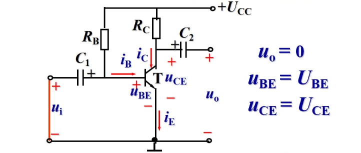

## 模拟电路

### 半导体器件

#### 本证半导体、杂质半导体和PN结

本征半导体：在半导体中，每个原子都有四个价电子，当半导体中的原子数目足够多时，每个原子都可以与四个相邻原子共享一个价电子，形成共价键，这样的半导体称为本征半导体。

杂质半导体：在半导体中，掺入少量杂质，使得半导体中的原子数目不足以与相邻原子共享四个价电子，这样的半导体称为杂质半导体。分为N型半导体和P型半导体。

N型半导体：掺入的杂质原子有五个价电子（如磷、砷、锑），其中四个价电子与相邻原子共享，而剩下的一个价电子处于自由状态，这样的半导体称为N型半导体。

P型半导体：掺入的杂质原子有三个价电子（如硼、镓、铟），其中三个价电子与相邻原子共享，而剩下的一个价电子处于缺电子状态，这样的半导体称为P型半导体。

PN结：将N型半导体和P型半导体的晶体片背靠背地粘合在一起，使得P型半导体中的自由电子与N型半导体中的空穴结合，形成一个电子云，这样的结构称为PN结。

PN结具有单向导电性，当 P 接入正电压，N 接入负电压时，正向电流较大、电阻较小，为导通状态（正向偏置）；当 P 接入负电压，N 接入正电压时，正向电流较小、电阻较大，为截止状态（反向偏置）。

温度越高，反向电流越大。

二极管分为：点接触型、面接触型、平面型。

#### 二极管的伏安特性

主要参数：

- 最大整流电流$I_{OM}$：允许流过二极管的最大正向电流。
- 反向工作峰值电压$U_{RWM}$：保证二极管在反向工作时不会击穿的最大反向电压。
- 最大反向电流$I_{RM}$：二极管加最高反向电压时的反向电流。

#### 二极管小结

- 正向偏置：正向导通，正向的电阻较小，正向的电流较大
- 反向偏置：反向截止，反向的电阻较大，反向的电流较小
- 反向击穿：反向电压超过反向工作峰值电压时，二极管会击穿，反向电流急剧增大，二极管会被烧毁

二极管的反向电流受温度影响较大，温度越高反向电流越大。

对于理想二极管，正向导通的时候压降为0，反向截止的时候二极管相当于断开。

二极管的分析方法：将其视为断路，比较两侧的电势。

#### 稳压二极管

文雅二极管在工作时加反向电压。工作状态为反向击穿，此时电压变化很小但是电流变化较大，使用时应加限流电阻。

主要参数：

- 稳定电压$U_Z$：稳压二极管在工作时（反向击穿）的电压。
- 电压温度系数$\alpha_U$：环境温度每变化 1 开尔文，稳压二极管的稳定电压变化的百分比。
- 动态电阻$r_z = \frac{\Delta U_Z}{\Delta I_Z}$：稳压二极管在工作时的动态电阻，$r_Z$ 越小，稳压性能越好。
- 最大稳定电流$I_{ZM}$、稳定电流$I_Z$
- 最大允许耗散功率$P_{ZM} = U_Z I_{ZM}$

### 三极管

#### 三极管的结构

- NPN 三极管：P 型半导体夹在两个 N 型半导体之间
- PNP 三极管：N 型半导体夹在两个 P 型半导体之间

#### 三极管电流分配和放大原理

三极管的电流关系：

$$ I_E = I_B + I_C $$

因为$I_B $远小于$ I_C$，所以可以近似认为$I_E \approx I_C$。定义**静态电流放大系数**：

$$\bar \beta = \frac{I_C}{I_B} $$

**动态电流放大率**，基极电流的较小的变化放大为集电极电流较大的变化：

$$ \beta = \frac{\Delta I_C}{\Delta I_B} $$

##### 三极管内部载流子的运动规律

以 NPN 型三极管为例，发射结正向偏置，集电结反向偏置。

1. 发射结正向偏置，发射区的电子**扩散**进入基区，并不断从电源获取新的电子，形成**发射极电流**$I_E$；由于基区的空穴浓度比发射区的自由电子浓度小得多，空穴向发射极的扩散忽略不计；
2. 发射区扩散到基区的电子主要聚集在发射结，而靠近集电结的电子密度较低，因而自由电子会继续向集电结扩散，过程中不断与基区的空穴结合；由于基区接电源的正极，基区中的电子不断被拉走，使得基区的空穴不断得到补充，形成了电流$I_{BE}$——基本上等于基极电流$I_B$；由于基区很薄而且掺杂度不高，绝大部分的电子都最终到了集电结的边缘；
3. 由于集电结的反偏，阻挡了集电区的自由电子往基区扩散，但是能反过来把发射区扩散上来的自由电子拉到几点去，形成了集电极电流$I_{CE}$——基本上等于集电极电流$I_C$；除此以外，集电区的少数载流子（空穴）和基区的少数载流子（自由电子）相向运动，形成了少量的集电极电流$I_{CBO}$——数值很小因为都是少数载流子，但是受温度影响很大而且与外界电压关系不大。

严格意义上，三极管的电流关系为：

$$
\bar \beta = \frac{I_{CE}}{I_{CB}} = \frac{I_{C} - I_{CBO}}{I_{CBO} + I_{B}} \approx \frac{I_{C}}{I_{B}}
$$

根据已知，$I_C$远大于$I_B$，而且对于一个很小的$\Delta I_B$，会引起一个很大的$\Delta I_C$。

##### 小结

外部条件：发射结正向偏置，集电结反向偏置。

NPN 型三极管，集电极电位最高，发射极电位最低；PNP 型三极管，集电极电位最低，发射极电位最高——而且都是负值，因为电流从发射极流入，方向和 NPN 是反的。

#### 三极管的伏安特性曲线

探究**共发射极接法**的特性曲线。

对于上述电路图，输入特性曲线（非线性）：

对于$U_{CE}$为常数时，基极电流$I_B$随$U_{BE}$的变化关系

当发射结电压大于死区电压时才会出现$I_B$

输出特性

1. 放大区 
  在放大区，$I_C = \beta I_B$，为线性区，具有恒流源特性。放大区，发射结正偏，集电结反偏。
2. 截止区 
  $I_B < 0$，有$I_C = 0$，为截止区，具有开路特性。截止区，发射结反偏，集电结反偏。
3. 饱和区 
  $U_{CE} \leq U_{BE}$，有$\beta I_B \geq I_C$，为饱和区，发射结正偏，集电结正偏。

### 基本放大电路

实质是将小能量的信号通过三极管的**控制**作用，将放大电路直流电源的能量转化为交流输出。

对放大电路的要求：

- 要有合理的放大倍数
- 尽可能小的波形失真

#### 放大电路的静态分析

放大电路无信号输入时的电路状态。

$$
U_{CC} = U_{CE} + I_CR_C
$$

$$
I_B = \frac {U_{CC} - U_{BE}}{R_B} \approx \frac {U_{CC}}{R_B}
$$

$$
I_C = \beta I_B
$$

#### 放大电路的动态分析

放大电路有（交流）信号输入时的电路状态。此时电容视为短路，并简化电路图为：

输入回路，对于一个极小的$\Delta U{BE}$，近似认为晶体管电流的变化量与其线性相关，即：

$$
r_{BE} = \frac{\Delta U_{BE}}{\Delta I_B} \Big |_{U_{CE} } = \frac {u_{be}}{i_b} \Big |_{U_{CE} }
$$

对于小功率二极管，$r_{BE} \approx 200 \Omega + (1+\beta) \frac {26 mV}{I_E}$，其中$\beta$为静态电流放大系数，$I_E$为静态电流。

对于输出回路，晶体管放大系数$\beta$：

$$
\beta = \frac{\Delta I_C}{\Delta I_B} \Big |_{U_{CE} } = \frac {i_c}{i_b} \Big |_{U_{CE} }
$$

一般情况下，$\beta$在20~200之间。

输出电阻（阻值很高）：

$$
r_{CE} = \frac{\Delta U_{CE}}{\Delta I_C} \Big |_{I_B} = \frac {u_{ce}}{i_c} \Big |_{I_B}
$$

因此，对于微变，将晶体三极管可等效为：

使用相量推导电压放大倍数$A_u$：

$$
\begin{align*}
A_u &= \frac{\dot U_{o}}{\dot U_{i}} \\
&= \frac{-\beta \dot I_b r_{ce}}{\dot I_b r_{be}} \\
&= -\beta \frac{r_{ce}}{r_{be}}
\end{align*}
$$

其中$r_{ce}$为$R_C$与$R_L$并联后的电阻。如果$R_L$未接入（断路），则$A_u = -\beta \frac{R_C}{r_{be}}$。

对于输入电阻，$r_i = \frac {\dot U_i}{\dot I_i}$，希望信号源获得的输入电流足够小，因此输入电阻应较大。

由于$r_i$为$R_B$与$r_{be}$并联后的电阻，当$R_B$很大时，$r_i \approx r_{be}$。

对于输出电阻，$r_o = \frac {\dot U_o}{\dot I_o}$。输出电阻表示了放大电路带负载的能力。一般希望较小的输出电阻。

要求$r_i$，一般先断开负载$R_L$，另输入电压为0，外加电压$\dot U_o$，求$\dot I_o$：

$$
\begin{gather}
\dot I_o = \dot I_c + \dot I_{R_C} \\
\dot I_b = 0 \\
\dot I_c = 0 \\
r_o = \frac {\dot U_o}{\dot I_o} = \frac {\dot U_o}{\dot I_{R_C}} = R_C
\end{gather}
$$
