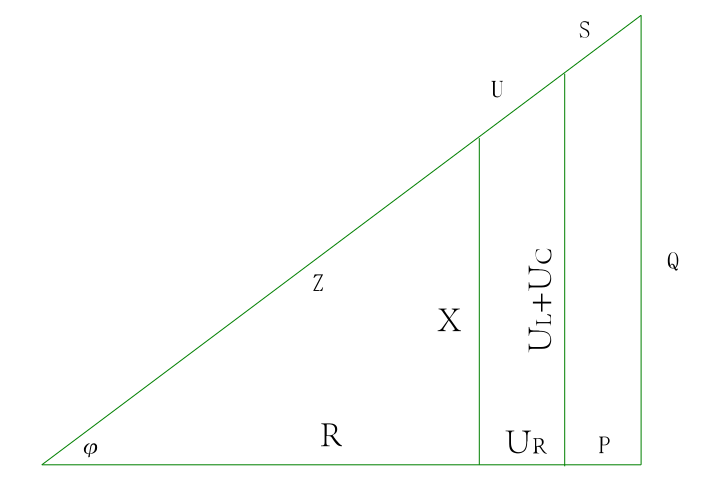

# 电路基础

## 最基本的定律

欧姆定律：$U=IR$

电源的有载工作：$U=I(R+r)$， 其中$R$为电源内阻，$r$为负载电阻

功率和功率平衡：$P=UI=EI-R_0I^2$，其中$R_0$为电源内阻

## 基尔霍夫定律

- **KCL**：电路中任意一个节点的电流代数和为0，即$\sum\limits_{i=1}^n I_i=0$，其中$I_i$为流入节点的电流；
- **KVL**：电路中任意一个回路循行方向，回路中电压代数和为0，即$\sum\limits_{i=1}^n U_i=0$，其中$U_i$为沿着循行方向的电压

KCL推广：可以将电路中的某个部分看作一个节点，流入这个部分的电流等于流出这个部分的电流；
KVL的电流表示：$\sum E=\sum U_z = \sum IR$，其中$E$为电源电动势，$U_z$为电阻$R$两端的电压。
KVL推广：对于一个开路，开口电压$U$等于电源电动势$E-IR$。

使用基尔霍夫定律时，应先标注出电流电压的**参考方向**，然后按照参考方向写出方程，最后解方程。

电位的概念：电路中某点相对于参考点的电势差。

## 电路分析方法

一端口电路：将多个元件看作一个整体，只有两个端口与外部连接。如果两个一端口网络的端口处伏安特性相同，则这两个网络等效。

串联电路：$R=R_1+R_2+\dots+R_n$，$U=U_1+U_2+\dots+U_n$，$I=I_1=I_2=\dots=I_n$

并联电路：$\dfrac{1}{R}=\dfrac{1}{R_1}+\dfrac{1}{R_2}+\dots+\dfrac{1}{R_n}$，$U=U_1=U_2=\dots=U_n$，$I=I_1+I_2+\dots+I_n$

电压源模型：电压源与电阻串联，电压源的电压等于电源电动势，电阻等于电源内阻。

电流源模型：电流源与电阻并联，电流源的电流等于电源电流，电阻等于电源内阻。

二者的互相转化：对于一个电压源$E$内阻$R_0$与$R_L$串联，可视为一个电流源$I_s$内阻$R_0$与$R_L$并联，其中$I_s=\dfrac{E}{R_0}$即$E=I_sR_0$。

支路电流法：对于一个电路，将电路中的每个支路的电流都标注出来，然后根据基尔霍夫定律列出方程，最后解方程。一般来说，对于一个$n$个节点$b$条支路的电路，需要列出$n-1$个KCL方程，$b-n+1$个KVL方程，共$b$个方程，从而解出$b$个未知数（就是各个支路的电流）。

节点电压法：对于两个节点之间的若干支路，电流可通过基尔霍夫定律或者欧姆定律计算，再根据基尔霍夫定律，节点处的电流流入等于流出列方程。

## 电路定理

Thevenin 定理：任何线性电路都可以用一个电压源和一个串联电阻来等效。

叠加定理：线性电路中，各个电源分别作用时，电路中任意两点间的电压等于各个电源分别作用时，电路中任意两点间的电压的代数和。

叠加定理的使用：将电路中的电源分别作用，求出各个电源作用时的电路中任意两点间的电压，然后将这些电压代数和，即可得到电路中任意两点间的电压。具体来说，将所有不作用的电压源视为短路，所有不作用的电流源视为开路。

Norton 定理：任何线性电路都可以用一个电流源和一个并联电阻来等效。

Thevenin 定理的使用：将两个端口短路，求出两个端口处的电流，即可得到等效电流源的电流，然后将两个端口开路，求出两个端口处的电压，于是可得到等效电流源的内阻。

此外，还有非线性的电阻，伏安特性曲线$U=f(I)$不是一条直线，而是一条曲线，这样的电阻称为非线性电阻。

非线性电阻的分析需要指明工作电流和工作电压，$R=\frac U I$，其中$U$为工作电压，$I$为工作电流，事实上$R$就是在这个点函数$f$的导数，即$R=\dfrac{\mathrm{d}U}{\mathrm{d}I}$。

> （待补充）

## 几个常见的电路元件

### 电阻

$$
\begin{gather}
R=\frac{u}{i}  \tag{r.1} \\
u=Ri \tag{r.2}
\end{gather}
$$

$(r.2)$式子两边乘以$i$并从$0$到$t$积分，得到：
$$
\int_0^t ui\mathrm{d}t=\int_0^t Ri^2\mathrm{d}t
$$
表明电能全部消耗在电阻上，即电阻是**耗能元件**。

### 电感

$$
\begin{gather}
L=\frac{N\Phi}{i} \tag{l.1} \\
\end{gather}
$$

电感$L$的单位是亨利（Henry），$1H=1\frac{V\cdot s}{A}$，即$1H$的电感，当电流变化率为$1A/s$时，其两端电压为$1V$。磁通量$\Phi$的单位是韦伯（Weber），$1Wb=1\frac{V\cdot s}{m^2}$，即$1Wb$的磁通量，当磁场变化率为$1T/s$时，其面积为$1m^2$。

当电感元件的磁通量或者电流发生变化时，会产生电动势：

$$
e_L=-\frac{\mathrm{d}\Phi}{\mathrm{d}t}=-L\frac{\mathrm{d}i}{\mathrm{d}t}
$$

根据基尔霍夫定律：

$$
\begin{gather}
u+e_L=0 \notag \\
u=-e_L=L\frac{\mathrm{d}i}{\mathrm{d}t} \tag{l.2}
\end{gather}
$$

类似地，$(l.2)$两侧乘以$i$并从$0$到$t$积分，得到：

$$
\int_0^t ui\mathrm{d}t=\int_0^i Li\mathrm{d}i = \frac{1}{2}Li^2 \tag{l.3}
$$

可见得电流增大，磁场能量增大，电能转化为磁能，反之磁能转化为电能，也就是说电感不消耗能量，是**储能元件**。

### 电容

$$
C=\frac{q}{u} \tag{c.1} \\
$$

电容$C$单位是法拉（Farad），$1F=1\frac{C}{V}$，即$1F$的电容，当电压变化率为$1V/s$时，其两端电荷为$1C$。

当电容元件的电荷量或电压发生变化时，会产生电流：

$$
i_C=\frac{\mathrm{d}q}{\mathrm{d}t}=C\frac{\mathrm{d}u}{\mathrm{d}t} \tag{c.2}
$$

（此式子中$u$和$i$参考方向相同）

将$(c.2)$式子两侧乘以$u$再从$0$到$t$积分，得到：

$$
\int_0^t i_Cu\mathrm{d}t=\int_0^u Cu\mathrm{d}u = \frac{1}{2}Cu^2 \tag{c.3}
$$

可见得电压增大，电场能量增大，电能转化为电场能量，反之电场能量转化为电能，也就是说电容不消耗能量，是**储能元件**。

> 此处的$L$、$C$、$R$可以理解为分别对应于机械系统中的质量$m$、弹簧常数$k$、阻尼系数$b$，三者在此处先规定为常数（实际情况更复杂）；$u$、$i$可以理解为分别对应于机械系统中的位移$x$、速度$v$。

> （本章内容下次补充，非考点范围的RC RL电路）

## 正弦交流电路

几个最基本的公式：

$$
\begin{gather}
f=\frac{1}{T} \notag \\
\omega=\frac{2\pi}{T}=2\pi f \notag
\end{gather}
$$

正弦电流的表示：

$$
i=I_m\sin(\omega t) \tag{ac.i.1}
$$

其中$I_m$为电流的最大值，也称为**峰值电流**，单位是安培（Ampere）；但是实际上，我们更多地使用**有效值**，即：

$$
\begin{align}
\int_0^T i^2R\mathrm{d}t&=I^2_{\mathrm{eff}}RT \\
I_{\mathrm{eff}} &=\sqrt{\frac{1}{T}\int_0^T i^2\mathrm{d}t} \\
&=\sqrt{\frac{1}{T}\int_0^T I_m^2\sin^2(\omega t)\mathrm{d}t} \\
&=\sqrt{\frac{1}{T}\int_0^T \frac{I_m^2}{2}(1-\cos(2\omega t))\mathrm{d}t} \\
&=\sqrt{\frac{I_m^2}{2T}\left(\int_0^T \mathrm{d}t-\int_0^T \cos(2\omega t)\mathrm{d}t\right)} \\
&=\sqrt{\frac{I_m^2}{2T}\left(T-0\right)} \\
&=\sqrt{\frac{I_m^2}{2}} \\
&=\frac{I_m}{\sqrt{2}} \tag{ac.i.2}
\end{align}
$$

类似地可以计算出

$$
u=U_m\sin(\omega t) \tag{ac.u.1}
$$

其中$U_m$为电压的最大值，也称为**峰值电压**，单位是伏特（Volt）；类似于上面的推导我们可以得出其**有效值**为:

$$
U_{\mathrm{eff}}=\frac{U_m}{\sqrt{2}} \tag{ac.u.2}
$$

相位和初相位：

$$
i=I_m\sin(\omega t+\psi)
$$

在这种情况下$i_0=I_m\sin\psi$，$\psi$称为**初相位**，单位是弧度（radian）；而$\omega t+\psi$称为**相位**，单位也是弧度。

正弦量的表示，根据欧拉公式：

$$
e^{j\theta}=\cos\theta+j\sin\theta
$$

可以将一个特定的正弦量表示为一个复数$A$：

$$
\begin{align}
A&=a+jb \\ &=rcos\psi+jrsin\psi =r(\cos\psi+j\sin\psi) \\ &=r\cdot e^{j\psi}
\end{align}
$$

或者简写为：

$$
A=r\phase{\psi}
$$

其中$r$称为**幅值**，$\psi$称为**相位**，$A$称为**复数**。

由于$\omega$已知在同一个电路中通常是相同的，我们只需要考虑初相位的差异，就可以通过复数表示正弦量，称为**相量**。

$$
\begin{gather}
\dot U = U(\cos\psi + j\sin\psi) = Ue^{j\psi} = U\phase{\psi} \tag{ac.u.3} \\
\dot I = I(\cos\psi + j\sin\psi) = Ie^{j\psi} = I\phase{\psi} \tag{ac.i.3}
\end{gather}
$$

注意这些标识，我们再来整理一下

| 量 | 瞬时值 | 有效值 | 峰值 | 相量 |
| --- | --- | --- | --- | --- |
| 电压 | $i$ | $U$ | $U_m$ | $\dot U$ |
| 电流 | $u$ | $I$ | $I_m$ | $\dot I$ |

这些标志在后面的分析中会经常用到，千万不要搞混了。

### 电阻和交流电路

$$
\begin{align}
i =\frac{u}{R} &= \frac{U_m}{R}\sin(\omega t) = \sqrt{2}I\sin(\omega t) \tag{ac.r.1} \\
u=Ri &= RI_m\sin(\omega t) \notag \\&= \sqrt{2}RI\sin(\omega t)\tag{ac.r.2} \\&= \sqrt{2}\red{U}\sin(\omega t)\notag  \\
\end{align}
$$

由此可见：

1. 频率不变；
2. 大小关系为$U=RI$；
3. 相位关系为$\psi_u=\psi_i$，即相位差$\varphi=\psi_u-\psi_i=0$。
4. 相量关系$\dot U = U\phase{\psi_u} = RI\phase{\psi_i} = R\dot I$
5. 功率关系：

$$
\begin{align}
\text{瞬时功率}
p &= ui \\
&= \sqrt{2}Isin(\omega t) \cdot \sqrt{2}Usin(\omega t) \\
&= U_mI_m\sin^2(\omega t) \\
&= \frac{U_mI_m}{2}(1-\cos(2\omega t)) \geq 0 \\
\text{平均功率}
P&=\frac{1}{T}\int_0^T p\mathrm{d}t \\
&=\frac{U_mI_m}{2}\left(\frac{1}{T}\int_0^T \mathrm{d}t-\frac{1}{T}\int_0^T \cos(2\omega t)\mathrm{d}t\right) \\
&= \frac{U_mI_m}{2}\left(1-\frac{1}{T}\int_0^T \cos(2\omega t)\mathrm{d}t\right) \\
&= \frac{U_mI_m}{2} \\
&= UI = RI^2 = \frac{U^2}{R} \\
\end{align}
$$

### 电感和交流电路

电感的电压电流关系为$u=L\frac{\mathrm{d}i}{\mathrm{d}t}$。代入$(ac.i.1)$，得到：

$$
\begin{align}
i&=I_m\sin(\omega t)=\sqrt{2}I\sin(\omega t) \tag{ac.l.1} \\
u&=L\frac{\mathrm{d}i}{\mathrm{d}t} \\
&= \omega LI_m\cos(\omega t) \\
&= \sqrt{2}\omega LI\cos(\omega t) \\
&= \sqrt{2}\omega LI\sin(\omega t+\frac{\pi}{2}) \tag{ac.l.2} \\
&= \sqrt{2}\red{U}\sin(\omega t+\frac{\pi}{2}) \\
\end{align}
$$

由此可见：

1. 频率不变；
2. 有效值的关系：$U=I\omega L$或者$I=\frac{U}{\omega L}$；
3. 电压超前电流$\frac{\pi}{2}$，即$\psi_u=\psi_i+\frac{\pi}{2}$，即相位差$\varphi=\psi_u-\psi_i=\frac{\pi}{2}$。

**感抗**：$X_L=\omega L = 2\pi fL$

则有$U = X_LI$；

注意，感抗只是电压和电流的幅值或者有效值之比，不是瞬时值之比，即$\frac{u}{i}\neq X_L$，事实上电压和电流成导数关系，即$u=X_L\frac{\mathrm{d}i}{\mathrm{d}t} = XI_m\sin(\omega t+\frac{\pi}{2})$。

那么，对于相量，$\dot U = Ue^{j \frac{\pi}{2}}$，$\dot I = Ie^{j 0}$：

$$
\begin{align}
\frac{\dot U}{\dot I} &= \frac{Ue^{j \cdot \frac{\pi}{2}}}{Ie^{j \cdot 0}} \\
&= \frac{U}{I}e^{j\cdot \frac{\pi}{2}} \\
&= jX_L \\
\dot U &= j\dot I X_L \\
&= j\dot I \omega L \\
\end{align}
$$

功率的计算：

$$
\begin{align}
\text{瞬时功率}
p &= ui \\
&= \sqrt{2}I\sin(\omega t) \cdot \sqrt{2}U\sin(\omega t+\frac{\pi}{2}) \\
&=2UI\sin(\omega t)\cos(\omega t) \\
&= UI\sin(2\omega t) \\
\text{平均功率}
P&=\frac{1}{T}\int_0^T p\mathrm{d}t \\
&=\frac{UI}{2}\left(\frac{1}{T}\int_0^T \sin(2\omega t)\mathrm{d}t\right) \\
&= 0 \\
\end{align}
$$

由于电感不消耗能量，所以平均功率为0，只有电源和电感元件之间的能量转化，我们将这种能量转化的规模用**无功功率**（瞬时功率的幅值）来表示，即：

$$
Q=UI = \frac{U^2}{X_L} = X_LI^2
$$

单位为伏特安培乘以秒，即瓦特秒（Watt second），也称为**乏**（Var）。

### 电容和交流电路

电容的电压电流关系为$i=C\frac{\mathrm{d}u}{\mathrm{d}t}$。代入$(ac.u.1)$，得到：

$$
\begin{align}
u&=U_m\sin(\omega t)=\sqrt{2}U\sin(\omega t) \tag{ac.c.1} \\
i&=C\frac{\mathrm{d}u}{\mathrm{d}t} \\
&= \omega CU_m\cos(\omega t) \\
&= \sqrt{2}\omega CU\cos(\omega t) \\
&= \sqrt{2}\omega CU\sin(\omega t+\frac{\pi}{2}) \tag{ac.c.2} \\
&= \sqrt{2}\red{I}\sin(\omega t+\frac{\pi}{2}) \\
\end{align}
$$

由此可见：

1. 频率不变；
2. 有效值的关系：$I=\omega CU$或者$U=\frac{I}{\omega C}$；
3. 电流超前电压$\frac{\pi}{2}$，即$\psi_i=\psi_u+\frac{\pi}{2}$，即相位差$\varphi=\psi_u-\psi_i=-\frac{\pi}{2}$。

**容抗**：$X_C=\frac{1}{\omega C} = \frac{1}{2\pi fC}$

则有$U = \frac{I}{X_C}$；

注意，容抗只是电压和电流的幅值或者有效值之比，不是瞬时值之比，即$\frac{u}{i}\neq X_C$，事实上电流和电压成导数关系，即$i=X_C\frac{\mathrm{d}u}{\mathrm{d}t} = XI_m\sin(\omega t+\frac{\pi}{2})$。

那么，对于相量，$\dot U = Ue^{j \frac{\pi}{2}}$，$\dot I = Ie^{j 0}$：

$$
\begin{align}
\frac{\dot U}{\dot I} &= \frac{Ue^{j \cdot \frac{\pi}{2}}}{Ie^{j \cdot 0}} \\
&= \frac{U}{I}e^{j\cdot \frac{\pi}{2}} \\
&= -jX_C \\
\dot U &= -j\dot I X_C \\
&= -j \frac{\dot I}{\omega C} \\
&= \frac{\dot I}{j\omega C}
\end{align}
$$

功率的计算：

$$
\begin{align}
\text{瞬时功率}
p &= ui \\
&= \sqrt{2}I\sin(\omega t+\frac{\pi}{2}) \cdot \sqrt{2}U\sin(\omega t) \\
&=2UI\sin(\omega t+\frac{\pi}{2})\cos(\omega t) \\
&= -UI\sin(2\omega t) \\
\text{平均功率}
P&=\frac{1}{T}\int_0^T p\mathrm{d}t \\
&=\frac{UI}{2}\left(\frac{1}{T}\int_0^T -\sin(2\omega t)\mathrm{d}t\right) \\
&= 0 \\
\text{无功功率}
Q&=-UI = -\frac{U^2}{X_C} = -X_CI^2
\end{align}
$$

### 上述三种元器件的串联

#### 分压关系和阻抗三角形、电压三角形

假设一个电路有一个电阻$R$，一个电感$L$，一个电容$C$，并联在一起，电压为$u$，电流为$i$，则有：

$$
\begin{align}
u&=Ri+L\frac{\mathrm{d}i}{\mathrm{d}t}+\frac{1}{C}\int i\mathrm{d}t \\
\dot U &= R\dot I + j\omega L\dot I + \frac{\dot I}{j\omega C} \\
&= \dot I\left[R+j\left(X_L-X_C\right)\right] \\
\end{align}
$$

将式子里面的$R+j\left(X_L-X_C\right)$记为$Z$，则有：

$$
\begin{align}
Z &= R+j\left(X_L-X_C\right) \\
&= \sqrt{R^2+\left(X_L-X_C\right)^2}e^{j\cdot\arctan\frac{X_L-X_C}{R}} \\
&= \red{|Z|}e^{j\red\varphi} \\
\end{align}
$$

其中$|Z|$称为**阻抗模**，$\frac{U}{I} = \sqrt{R^2+\left(X_L-X_C\right)^2} = |Z|$，单位为欧姆（Ohm）；$\varphi$称为**阻抗的幅角**，$\varphi = \arctan\frac{X_L-X_C}{R}$，单位为弧度，即电流和电压的相位差。

> 可以将阻抗的复数形式理解为，实部为“阻”，虚部为“抗”，即阻抗的实部为电阻，虚部为电抗，电抗有两种，一种是感抗，一种是容抗；既表示了大小关系$|Z|$，也表示了相位关系$\varphi$。

#### 功率的计算与功率三角形

$$
\begin{align}
\text{对于} \\
i&=I_m\sin(\omega t) \\
u&=U_m\sin(\omega t+\varphi) \\
\text{瞬时功率}
p &= ui \\
&= U_mI_m\sin(\omega t+\varphi)\sin(\omega t) \\
&= UI\cos(\varphi) - UI \cos(2\omega t+\varphi) \\
\text{平均功率}
P&=\frac{1}{T}\int_0^T p\mathrm{d}t \\
&= \frac{1}{T} \int_0^T \left[UI\cos(\varphi) - UI \cos(2\omega t+\varphi)\right] \mathrm{d}t \\
&= \frac{1}{T} \left[UI\cos(\varphi)\int_0^T \mathrm{d}t - UI \int_0^T \cos(2\omega t+\varphi)\mathrm{d}t\right] \\
&= \frac{1}{T} \left[UI\cos(\varphi)T-0\right] \\
&= UI\cos\varphi \\
\text{无功功率}
Q&=U_LI-U_CI = X_LI^2-X_CI^2 = |Z|I^2\sin\varphi = UI\sin\varphi
\end{align}
$$

可见，功率不仅与电源（发电机）的端电压和输出电流的有效值的乘积有关，还与负载的参数有关（因为负载会影响到$\varphi$），我们称$\cos(\varphi)$为**功率因数** 。

定义**视在功率**： $S=UI=|Z|I^2$

如果用直角三角形描述这个功率的关系，可以得到：

### 阻抗的串并联

#### 串联

$$
Z = \sum Z_k = \sum R_k + j \sum X_k =|Z|e^{j\varphi} = |Z|\phase{\varphi}
$$

#### 并联

$$
\frac{1}{Z} = \sum \frac{1}{Z_k}
$$
