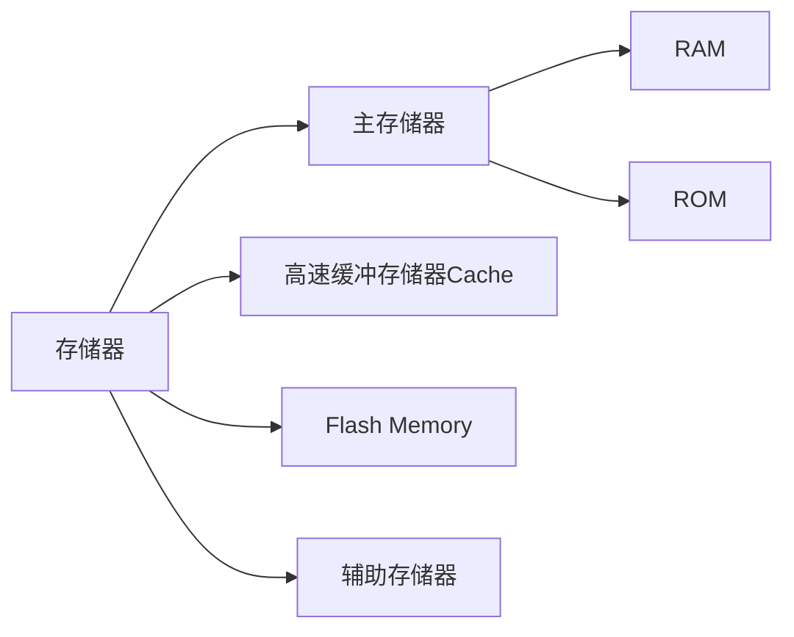

# 存储器

存储器按介质分类，可分为半导体存储器（如TTL、MOS等）易失性存储器和磁存储器（磁芯和磁表面存储器）、光盘等非易失性存储器。

按存取方式：存取时间与物理地址无关（随机访问）和存取时间与物理地址有关（串行访问）。

以下为重点：按在计算机中的作用分类

```mermaid
graph LR
A[存储器] --> B[主存储器]
A --> C[高速缓冲存储器Cache]
A --> D[Flash Memory]
A --> E[辅助存储器]
B --> F[RAM]
B --> G[ROM]
```