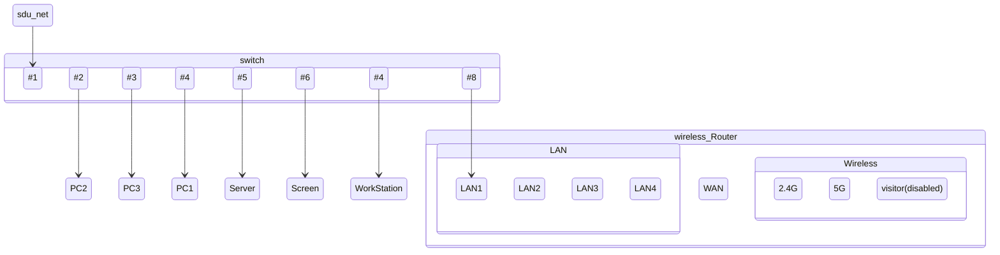
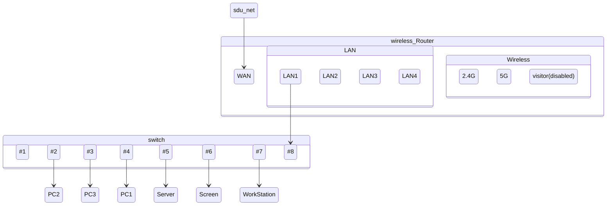
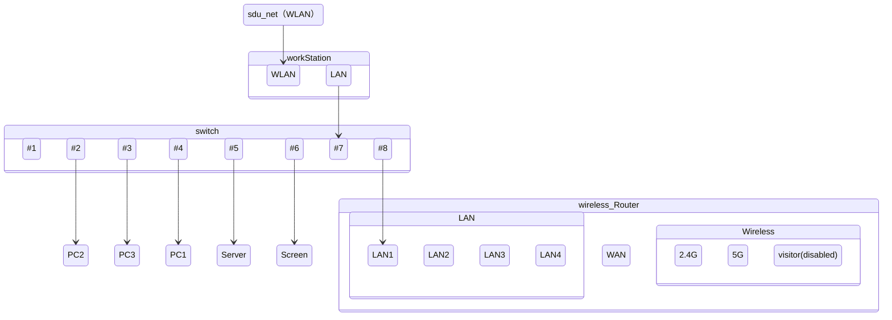

# 记办公室网从完全炸掉到勉强能用的修复过程

## 背景

办公室的网络有一天突然无法使用了。最开始的症状是，WLAN 无法连接，虽然密码输对了但是就是连接不上。

并且，对于新接入办公室网络的设备，都不能自动跳转 WLAN 的登录页面，因此无法使用网络。

办公室的网络是这样的：



至于为什么这么设计，主要是考虑到sdu_net按MAC地址分配带宽，如果使用了路由器组成子网，那么路由器的MAC地址就会被sdu_net识别，从而导致所有设备的总带宽就是路由器的MAC地址对应的带宽，网速会严重受限。

由于这种情况下，网络中的设备都直接使用了sdu_net中DHCP分配的IP地址，因此无法使用路由器的DHCP功能，再加上租期的限制，已经不可能知道路由器现在的IP地址是什么了。而且sdu_net的安全性限制了局域网中设备互相访问，无法登入路由器的管理页面。

我们只能长按路由器的重置键，将路由器恢复出厂设置，然后重新配置路由器。

本来应该没什么问题的。重置完路由器之后，将交换机接到路由器的线暂时接到路由器的WAN口，由于DHCP默认打开，我们将LAN口接到一个电脑上，那个电脑就可以通过网关的IP地址访问到路由器的管理页面。简单配置了LAN口，关闭了DHCP服务器功能并将LAN口的IP地址改为自动获取，然后将入户线接回LAN口。

然后，我们发现，办公室的电脑都一下子全部连不上网了。

接下来，我们尝试将入户线直接接上交换机，拔下路由器。将所有设备全部接入交换机。在Windows设备上，运行

```batch
ipconfig /renew
```

然后，意外地发现——居然无法获取 IP 地址了。那么问题应该在上游。

随后，我将入户线直接插到我的电脑上面，能分配IP并且登录之后能正常上网。接下来再将入户线插回交换机，还是一样的效果，无法上网，无法分配 IP 地址。

暂时的解决办法是，既然不知道为什么入户线只能让一个设备联网，就接入路由器的 WAN 口，由于路由器的 MAC 地址已经被之前的某个人设置为了无感知，登录的步骤也跳过了。

此时，办公室的网络拓扑变成了这样：



## 问题重现

接下来的几天办公室网络访问总是非常卡顿和不稳定。带宽的限制理论上也不至于这么严重。

对于一个不稳定的网络，首先想到的就是丢包率。于是我在办公室的电脑上面运行：

```batch
ping -t www.baidu.com
```

运行了半个小时，测试出丢包率在50%左右。难怪DHCP无法正常使用，因为数据包丢的差不多了。一台设备还勉勉强强凑合——多发几个数据包总有一两个能成功；设备一多就肯定不行了。

这种问题只好找网管来解决了。网管在后台发现，办公室的设备频繁上线、下线；测试硬件，入户的网口1#芯基本不能正常工作（估计因此导致丢包）。

但是由于线都走在墙面内部，不方便重新排线，只能等后续安排；但是办公室的设备无法连网的问题还是要解决的。这种时候就只能想些不太正常的办法了。

我们得到了一个无线网卡。将网卡插在一个电脑上面并连接到了无线网络，把Internet连接共享到子网，该电脑的有线网卡连上路由器的 LAN 口，路由器的 LAN 再接上交换机；配置该电脑为网关，IP地址 192.168.137.1，路由器设置了一个我能记住的IP 192.168.137.254，设置路由器的 DHCP 区段在 192.168.137.xxx 并将 DNS 服务器设置到了公共 DNS 9.9.9.9 上面。

问题暂时解决。

附上解决方案时的图：


